# Comprendre MADSC

> **Document pédagogique.** Destiné à quelqu'un qui veut comprendre MADSC en profondeur :
> l'auteur du projet qui reprend du recul, un encadrant, un jury de soutenance, ou un
> développeur qui reprend le code.
>
> **Source de vérité : le CODE, inspecté le 23 août 2026.** `HANDOFF.md` donne l'histoire et
> les intentions ; quand les deux divergent, c'est signalé.

## Conventions de lecture

| Badge | Signification |
|---|---|
| **[IMPLÉMENTÉ]** | présent dans le code, sous test |
| **[VALIDÉ SUR MOGADOR]** | en plus, vérifié sur le domaine réel avec des chiffres mesurés |
| **[PARTIEL]** | existe, mais avec une portée volontairement restreinte |
| **[LIMITE]** | ce que MADSC ne sait pas faire, et pourquoi |
| **[FUTUR]** | conçu ou envisagé, **pas écrit** |

Chaque grande section se termine par **Fichiers principaux**, pour revenir du document au code.

---

# Sommaire

1. [MADSC en une phrase](#1-madsc-en-une-phrase)
2. [Contexte du projet](#2-contexte-du-projet)
3. [Les principes fondamentaux](#3-les-principes-fondamentaux)
4. [Architecture générale](#4-architecture-générale)
5. [Comment MADSC démarre](#5-comment-madsc-démarre)
6. [Configuration de site et portabilité](#6-configuration-de-site-et-portabilité)
7. [Collecte — vue d'ensemble](#7-collecte--vue-densemble)
8. [Tableau complet des collecteurs](#8-tableau-complet-des-collecteurs)
9. [Les capteurs](#9-les-capteurs)
10. [Structure d'un snapshot](#10-structure-dun-snapshot)
11. [Ingestion et API](#11-ingestion-et-api)
12. [Base de données](#12-base-de-données)
13. [Les contrôles de sécurité](#13-les-contrôles-de-sécurité)
14. [Évaluation et score](#14-évaluation-et-score)
15. [Baseline et assurance de dérive](#15-baseline-et-assurance-de-dérive)
16. [Le modèle AD](#16-le-modèle-ad)
17. [Provenance](#17-provenance)
18. [Couverture](#18-couverture)
19. [Identity Graph](#19-identity-graph)
20. [`primaryGroupID`](#20-primarygroupid)
21. [Corroboration](#21-corroboration)
22. [ChangeGuard — idée générale](#22-changeguard--idée-générale)
23. [ChangeGuard GPO](#23-changeguard-gpo)
24. [Conseiller de déploiement](#24-conseiller-de-déploiement)
25. [Privilege Preflight](#25-privilege-preflight)
26. [Nouveau chemin ≠ nouvelle capacité](#26-nouveau-chemin--nouvelle-capacité)
27. [`CHANGEMENT_DIRECT_SANS_DELTA_DE_PRIVILEGE`](#27-changement_direct_sans_delta_de_privilege)
28. [Chaque page de l'application](#28-chaque-page-de-lapplication)
29. [Environnement AD en détail](#29-environnement-ad-en-détail)
30. [Mise en service](#30-mise-en-service)
31. [Détection / Wazuh — état actuel](#31-détection--wazuh--état-actuel)
32. [Flux complets d'une donnée](#32-flux-complets-dune-donnée)
33. [Sécurité de MADSC lui-même](#33-sécurité-de-madsc-lui-même)
34. [Tests](#34-tests)
35. [Bugs réellement trouvés par les tests](#35-bugs-réellement-trouvés-par-les-tests)
36. [Générique vs spécifique à Mogador](#36-générique-vs-spécifique-à-mogador)
37. [Limites actuelles](#37-limites-actuelles)
38. [Travaux futurs](#38-travaux-futurs)
39. [Décisions architecturales et justification](#39-décisions-architecturales-et-justification)
40. [Présenter MADSC à un encadrant](#40-présenter-madsc-à-un-encadrant)
41. [Questions probables des encadrants](#41-questions-probables-des-encadrants)
42. [Glossaire](#42-glossaire)
43. [Fiche de révision](#43-fiche-de-révision)

---

# 1. MADSC en une phrase

## En langage simple

> **MADSC surveille si un Active Directory qu'on a pris la peine de sécuriser l'est
> *toujours*, et permet d'essayer un changement *avant* de le faire.**

## Définition professionnelle

MADSC (*Mogador Active Directory Security Console*) est une console d'assurance de posture
Active Directory **100 % en lecture seule**, qui répond à quatre questions distinctes :

```
1. Ma configuration est-elle sûre ?        évaluation contre des attentes fixes
2. A-t-elle changé depuis validation ?     assurance de dérive contre une baseline
3. Mes capteurs de détection vivent-ils ?  santé de la télémétrie
4. Ce changement serait-il sûr ICI ?       préflight, sans rien appliquer
```

## Pourquoi ce n'est pas un simple scanner AD

Un scanner (PingCastle, Purple Knight) répond une fois : *« voici vos faiblesses aujourd'hui »*.
MADSC ajoute trois choses qu'un scanner ne fait pas :

| | Scanner | MADSC |
|---|---|---|
| Photographie l'état | ✅ | ✅ |
| **Conserve la preuve datée** | ✗ | ✅ base + horodatage + fraîcheur |
| **Détecte la dérive** vs un état approuvé | ✗ | ✅ baseline |
| **Simule un changement** avant application | ✗ | ✅ ChangeGuard |
| **Dit quand il ne sait pas** | rarement | ✅ contrat de couverture |

## Pourquoi ce n'est pas BloodHound

BloodHound est un outil **offensif** : il dessine un graphe de chemins d'attaque, et sa force
est de trouver *un* chemin. Sa faiblesse pédagogique est qu'**un graphe dessiné cache ce qu'il
n'a pas lu** : une arête absente à l'écran est visuellement indiscernable d'une preuve
d'absence.

MADSC :

- ne dessine **aucun graphe nœuds/arêtes** — il rend des **chaînes écrites**, saut par saut,
  chacune portant sa provenance ;
- accompagne **chaque relation** d'une **couverture** (`COMPLETE` / `PARTIELLE` / `INCONNUE`) ;
- ne joue **aucune attaque**.

> **À retenir.** BloodHound cherche un chemin. MADSC prouve ce qu'il a lu — et déclare ce
> qu'il n'a pas lu.

## Pourquoi ce n'est pas un tableau de bord Wazuh

Wazuh dit *« voici les alertes déclenchées »*. MADSC pose la question inverse, et plus
difficile : *« mes capteurs sont-ils encore capables de déclencher une alerte ? »*

C'est la thèse du projet :

> **Une absence d'alerte ne prouve pas que tout va bien. Un SIEM hors service ne peut pas
> signaler sa propre panne.**

MADSC sépare donc quatre faits que le sens commun confond :

```
la règle est déployée
la règle a été validée historiquement
les capteurs dont elle dépend sont sains
une alerte datée a réellement été observée
```

Aucun ne remplace un autre.

### Fichiers principaux

- `README.md`, `README_ARCHITECTURE.md`, `HANDOFF.md`
- `backend/coverage.py` (docstring d'en-tête : les quatre faits séparés)

---

# 2. Contexte du projet

## Le laboratoire de validation

MADSC a été développé et validé sur un domaine Active Directory fictif — `mogador.local`,
l'annuaire d'un hôtel — dans le cadre d'un PFA Purple Team en quatre phases : durcissement
(PingCastle 100 → 25), détection (Wazuh), alignement ISO 27001, puis MADSC.

| Hôte | Rôle | Particularité |
|---|---|---|
| `DC-01` | Contrôleur de domaine | WS2016 FR |
| `PMS-01` | Serveur membre Tier 1 | **service EventLog en panne** → angle mort SIEM assumé |
| `DESKTOP-0LKLBTR` | Poste Tier 2 | son agent Wazuh est enregistré sous `WS-01` |
| `KALI-01` | Manager Wazuh | — |

MADSC tourne sur le PC hôte, joignable des VM.

> **Limite** — la panne EventLog de `PMS-01` est **réelle et volontairement conservée**. Elle
> n'est pas un bug de MADSC : c'est le résiduel documenté du projet, et le fait que MADSC
> l'affiche est le comportement voulu.

## Environnement de validation ≠ architecture du produit

C'est une distinction que la soutenance doit rendre limpide :

| Environnement de validation (Mogador) | Architecture du produit (MADSC) |
|---|---|
| trois hôtes, un domaine, un manager Wazuh | conçue pour un annuaire quelconque |
| tiers `Tier0/1/2`, préfixe `DL_`, noms français | **déclarés** dans `config/*.toml`, pas codés |
| 20 règles Wazuh `1000xx` | **encore codées en dur** → voir §31 et §38 |

## La philosophie lecture seule

MADSC **n'écrit jamais** dans Active Directory. Ni objet, ni attribut, ni permission, ni GPO,
ni registre. Aucun `Set-*`, `New-AD*`, `Remove-*`, `Add-ADGroupMember`, aucun `gpupdate`.

Cette contrainte n'est pas une précaution : c'est ce qui rend l'outil **déployable sur un
annuaire de production sans négociation**. Un outil d'audit qui peut écrire doit être audité
lui-même.

### Fichiers principaux

- `collectors/*.ps1` (chacun déclare ses opérations de lecture en tête)
- `dashboard/data/lab_info.json` (description du laboratoire)

---

# 3. Les principes fondamentaux

Ces règles gouvernent tout le code. Les comprendre, c'est comprendre MADSC.

## 3.1 Lecture seule absolue

**Pourquoi.** Un outil d'assurance qui modifie l'objet qu'il mesure ne mesure plus rien.

**Comment c'est tenu.** Les collecteurs n'utilisent que des cmdlets `Get-*`, de l'ADSI en
lecture, `auditpol /backup`, `secedit /export`. `Collect-ADTopology.ps1` **affiche la liste
exacte** de ses opérations avant de les lancer, et propose un mode `-Preview` qui n'écrit ni
n'envoie rien.

## 3.2 Le SID fait foi, jamais le nom

**Idée simple.** Un groupe peut être renommé ; son SID, non.

**Pourquoi ici en particulier.** Le domaine est en français, et des groupes **ont déjà été
renommés**. `Administrateurs` (S-1-5-32-544) n'est pas `Administrators`. Comparer par nom
aurait produit des faux négatifs silencieux.

**Conséquence dans le code.** Le graphe d'identités est indexé par SID de bout en bout. Les
noms n'apparaissent que pour l'affichage — et plusieurs tests interdisent leur usage comme
preuve.

## 3.3 Ne jamais inventer une valeur

Un champ que le backend ne fournit pas s'affiche « Non disponible », **jamais estimé**.

**Corollaire appris en cours de route :** un champ qui vaut « Non disponible » *pour tout*
n'informe plus — il apprend au lecteur à sauter les champs. Un champ jamais alimenté a donc
été **retiré de l'écran**, pas rempli.

## 3.4 `INCONNU ≠ 0`

**L'erreur la plus dangereuse de tout le projet**, et celle qui revient le plus souvent.

```
« 0 sous-catégorie auditée »   ressemble à une catastrophe
la réalité était               « je n'ai rien pu mesurer »
```

Ces deux états appellent des **actions opposées** : corriger la configuration vs relancer la
collecte. Les confondre est un mensonge par omission.

Règle : **si une lecture échoue, n'émettre AUCUN contrôle et afficher pourquoi.**

## 3.5 `PARTIEL ≠ COMPLET`

Une couverture partielle veut dire : *les faits trouvés sont vrais, mais leur absence
n'apprend rien*. Voir §18.

## 3.6 La péremption ne retire que de la confiance

```
un CONFORME périmé  →  devient NON ÉVALUÉ
un ÉCART périmé     →  RESTE un écart
un N/A              →  n'est JAMAIS périmé
```

Un `N/A` dépend du **rôle** de l'hôte, pas du temps : un contrôle inapplicable à un poste le
reste indéfiniment.

## 3.7 Dernière preuve connue

Quand une preuve vieillit, MADSC **conserve** ce qu'il sait et **baisse la confiance**. Il
n'efface pas : la dernière chose qu'on sache reste la dernière chose qu'on sache. Mais elle
est présentée comme telle — *« dernières relations connues, PAS l'état courant »*.

## 3.8 Trois provenances (quatre depuis la v1.3)

```
OBSERVÉ                        lu dans l'annuaire ou un rapport
DÉRIVÉ                         calculé depuis un observé
DÉCLARÉ                        décidé par un humain dans config/*.toml
DÉRIVÉ d'un attribut OBSERVÉ   reconstruit depuis une valeur lue   [v1.3]
```

Voir §17 pour le détail et les exemples.

## 3.9 Preuve ≠ inférence

MADSC affiche des noms de groupes, mais **n'en conclut rien**. `DL_LAPS_T1_Operators` est un
libellé ; il ne devient jamais *« peut lire les mots de passe LAPS »* sans preuve collectée.
Le tier d'un principal ne se déduit ni d'un identifiant, ni d'un préfixe, ni d'un nom d'unité.

## 3.10 Absence de preuve ≠ preuve d'absence — dans les deux sens

Aucune alerte ne prouve pas qu'un hôte va bien (c'est la thèse du projet), **et** ne prouve
pas non plus qu'un capteur est mort. Un silence n'est affirmable que si l'hôte n'apparaît dans
**aucune** source.

## 3.11 Échec bruyant

Une configuration à moitié chargée est **pire** qu'un refus de démarrer : elle produit des
verdicts qui ont l'air normaux. Toute erreur dans un profil de site empêche le démarrage.

## 3.12 Lire n'approuve jamais

Approuver une baseline sans la relire validerait une modification hostile aussi volontiers
qu'une correction légitime. L'approbation est un geste **séparé et explicite**.

## 3.13 Les propositions ChangeGuard sont éphémères

Une proposition vit en mémoire le temps d'une réponse HTTP. Elle n'est **jamais persistée**.
Il n'y a rien à retrouver au rechargement — et donc rien à confondre avec un changement réel.

### Fichiers principaux

- `backend/ad_model.py` (docstring d'en-tête : le piège propre aux graphes)
- `backend/evaluate.py`, `backend/db.py` (péremption)
- `HANDOFF.md` §4 (« Règles à ne jamais violer »)

---

# 4. Architecture générale

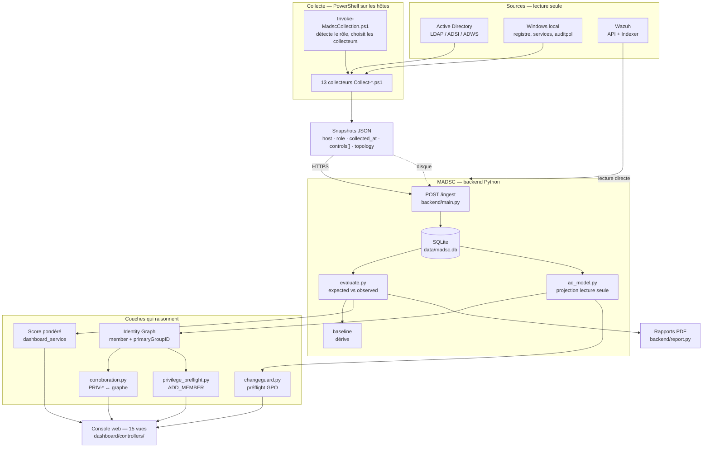

## Les couches, expliquées

| Couche | Rôle | Ne fait PAS |
|---|---|---|
| **Sources** | l'annuaire, les machines, le SIEM | — |
| **Collecte** | PowerShell sur les hôtes, 100 % `Get-*` | n'écrit rien, ne juge rien |
| **Snapshots** | JSON horodaté, autonome | — |
| **Ingestion** | valide, stocke, évalue | ne modifie pas les valeurs reçues |
| **Base** | mémoire datée des mesures | — |
| **Évaluation** | `expected` vs `observed`, dérive vs baseline | ne collecte pas |
| **Modèle AD** | projection **reconstruite à chaque appel** | ne stocke rien, ne conclut rien |
| **Raisonnement** | score, graphe, corroboration, préflight | n'écrit ni AD ni base |
| **Présentation** | 15 vues + rapports | ne recalcule pas la sémantique |

> **À retenir.** Le modèle AD est une **projection**, pas un magasin : aucune table, aucun
> cache, reconstruit à chaque appel. Un défaut ne peut donc ni corrompre une donnée, ni
> survivre à un redémarrage.

### Fichiers principaux

- `backend/main.py` (routes), `backend/db.py` (persistance)
- `backend/ad_model.py`, `backend/evaluate.py`, `backend/coverage.py`
- `dashboard/shell.py` (navigation), `dashboard/controllers/`

---

# 5. Comment MADSC démarre

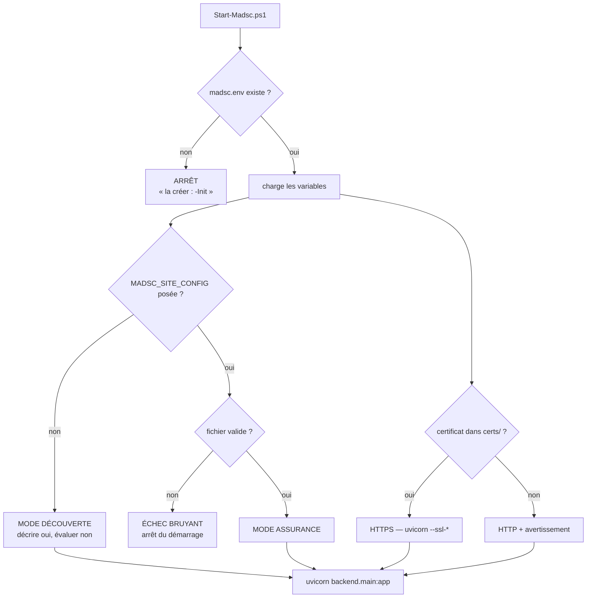

## Les trois cas de configuration de site

| `MADSC_SITE_CONFIG` | Fichier | Résultat |
|---|---|---|
| absente | — | **mode découverte** : décrire oui, évaluer non |
| posée | valide | **mode assurance**, comportement complet |
| posée | absent ou invalide | **échec bruyant** — surtout pas la découverte |

## Pourquoi le repli implicite a été supprimé **[IMPLÉMENTÉ]**

`site_config.charger()` retombait auparavant sur `config/mogador.toml` quand la variable était
absente. Démarrer sans elle faisait donc adopter **en silence** le modèle de sécurité de
Mogador — ses zones, ses conventions — à n'importe quel annuaire. Sur un domaine étranger,
chaque verdict aurait été rendu contre la politique d'une autre organisation, sans que rien ne
l'annonce.

> **Pour la soutenance.** C'est un excellent exemple de la philosophie du projet : un repli
> silencieux vers le mauvais référentiel est exactement le défaut que MADSC refuse partout
> ailleurs. Il a donc été retiré **de MADSC lui-même**.

Le troisième cas — fichier posé mais invalide — est délibéré : une faute de frappe dans un
chemin doit **arrêter** MADSC, pas dégrader en silence un site configuré dont les verdicts
disparaîtraient alors sans alerte.

## Deux « Non évalué » à ne pas confondre

| Cause | Signal | Action |
|---|---|---|
| `politique_non_approuvee` | aucun profil de site | **poser `MADSC_SITE_CONFIG`** |
| couverture < 50 % | mesures périmées | **relancer les collecteurs** |

## TLS

`Start-Madsc.ps1` active TLS **dès qu'un certificat est présent** dans `certs/`, et annonce le
schéma au démarrage (`Écoute : https://0.0.0.0:8700`).

> **Limite / piège documenté.** Une commande de collecte en `http://` sur un serveur TLS
> échoue sur *« la connexion sous-jacente a été fermée »* — un message qui ressemble à une
> panne réseau. `Test-NetConnection` réussit pourtant, puisque le port TCP est ouvert. **Lire
> le schéma que le serveur annonce.** Ce piège a réellement coûté une campagne complète.

### Fichiers principaux

- `Start-Madsc.ps1`, `madsc.env` (jamais versionné, jamais cité ici)
- `backend/site_config.py`

---

# 6. Configuration de site et portabilité

## Le principe

**La connaissance de site est sortie du code Python.** `config/*.toml` porte ce qui appartient
à l'organisation, pas au produit.

```toml
schema = 1

[site]
nom = "Mogador"
domaine = "mogador.local"

[[tiers]]
niveau  = 0
libelle = "Tier 0"
ous     = ["Tier0", "Domain Controllers"]

[modele_administration]
prefixes_domaine_local = ["DL_"]

[[admx]]
controle  = "LOG-PS-SCRIPTBLOCK"
fragments = ["journalisation de blocs de scripts", "script block logging"]
categories = ["powershell"]

[detection]
actif = false     # présent dans acme.toml et decouverte.toml
```

## Les trois profils livrés **[IMPLÉMENTÉ]**

| Fichier | Rôle |
|---|---|
| `config/mogador.toml` | le laboratoire — reproduit le comportement d'avant l'extraction |
| `config/acme.toml` | **preuve de portabilité** : autres unités, autres libellés, DEUX zones |
| `config/decouverte.toml` | amorçage, **déprécié** par le mode découverte natif |

`tests/test_portabilite_acme.py` vérifie qu'aucune ligne de Python n'est propre à Acme.

## Découverte automatique ≠ décision de sécurité automatique

C'est **le point le plus important de cette section**.

MADSC **peut découvrir** qu'une unité `OU=Tier0` existe. Il **peut constater** qu'une machine
se déclare contrôleur de domaine (le collecteur relaie son `ProductType`). Il **ne peut pas en
déduire** une classification de sécurité.

```
découverte automatique    →   « il existe une OU nommée Tier0 »        OBSERVÉ
décision de sécurité      →   « Tier0 est la zone la plus privilégiée » DÉCLARÉ
```

**Pourquoi c'est une règle et pas un scrupule.** Déduire un tier d'un nom d'unité ferait
classer `OU=Production` en Tier 1 parce que le mot sonne important. Le brouillon de profil
généré par MADSC (§30) **n'attribue donc aucun tier automatiquement — pas même à
« Domain Controllers »**, et n'est pas chargeable en l'état.

> **Limite** — un tier oublié dans un profil ne produit **aucune erreur**. Il fait simplement
> **disparaître un franchissement de frontière** de l'analyse. C'est une lacune silencieuse
> assumée : MADSC n'exige pas que chaque unité appartienne à un tier.

### Fichiers principaux

- `backend/site_config.py`, `config/mogador.toml`, `config/acme.toml`
- `backend/adtopology.py` (`tier_de_dn`, `libelle_tier`)
- `tests/test_site_config.py`, `tests/test_portabilite_acme.py`, `tests/test_mode_decouverte.py`

---

# 7. Collecte — vue d'ensemble

## Une campagne, étape par étape

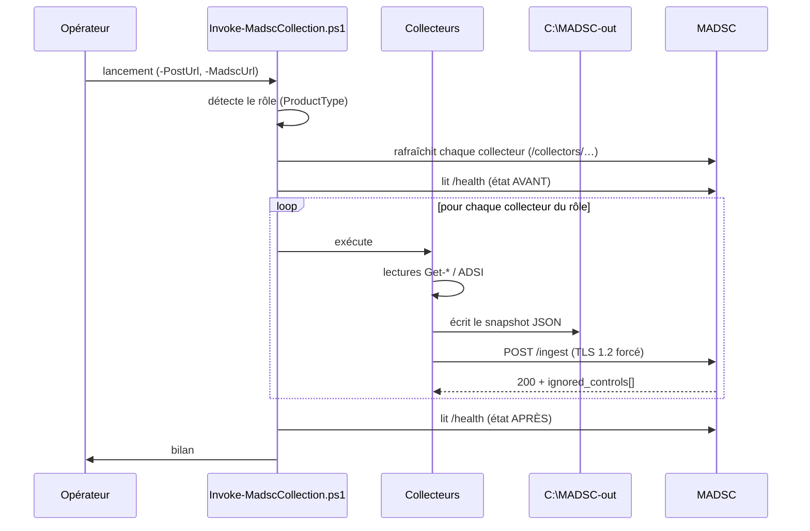

## Détection du rôle et sélection

`ProductType` Windows détermine le rôle, et le rôle détermine la liste :

| Rôle | Collecteurs | Nombre |
|---|---|---|
| `DC` (ProductType 2) | Protocols, AuditPolicy, DetectionSensors, PowerShellLogging, LAPS, **PrivilegedGroups**, **ADTopology**, ADConfig, Delegation, PasswordPolicy, GPO | **11** |
| `MEMBER` (3) / `WORKSTATION` | Protocols, AuditPolicy, DetectionSensors, PowerShellLogging, LAPS, **LocalAdmins**, **TierBoundaries** | **7** |

Les collecteurs à portée **domaine** (ADConfig, PrivilegedGroups, Delegation, PasswordPolicy,
ADTopology, GPO) ne tournent **que sur le DC** : leur donnée est répliquée, la collecter depuis
chaque hôte enregistrerait N fois la même mesure.

## Ordre significatif **[IMPLÉMENTÉ]**

`Collect-ADTopology.ps1` suit **immédiatement** `Collect-PrivilegedGroups.ps1`. Les deux
observent la même chose — la population effective des groupes privilégiés — par deux mécanismes
indépendants, et `backend/corroboration.py` les compare. **Cette comparaison n'a de sens que si
les deux relevés sont contemporains** (§21). Résultat mesuré : **Δ = 3 secondes**.

## Si MADSC est injoignable

Le snapshot est **quand même écrit sur disque** (`C:\MADSC-out`). L'envoi échoue avec un
message explicite, et le fichier reste disponible pour ingestion ultérieure.

> **Limite [LIMITE]** — le bilan affiche `Executes : 11 / 11` même quand **tous** les envois
> ont échoué. Ça se lit comme un succès. Le rafraîchissement des collecteurs échoue alors
> aussi, et la campagne repart sur les **copies locales anciennes** — un correctif appliqué
> côté dépôt n'atteint jamais le domaine. Ce défaut est identifié, **pas encore corrigé**.

## Clé d'API

Le POST porte un en-tête `X-MADSC-Key` **lu dans l'environnement**, jamais passé en paramètre
de ligne de commande (où il serait visible dans la liste des processus). Le runner prévient
**avant** la collecte si la clé manque, plutôt que de laisser onze erreurs identiques noyer la
cause.

> La valeur de la clé n'apparaît nulle part dans ce document, ni dans le dépôt.

## Lecture seule

Chaque collecteur déclare en tête ce qu'il fait et ce qu'il ne fait **jamais**.
`Collect-ADTopology.ps1` affiche la liste de ses opérations avant de les exécuter :

```
Get-ADDomain                     DN, SID et nom DNS du domaine
Get-ADComputer -Filter *         nom, SID, DN et OS de chaque machine
Get-ADGroup -Filter *            SID, nom et PORTEE de chaque groupe
Get-ADOrganizationalUnit         DN de chaque unite d'organisation
ADSI (objectSid=*)               index DN -> SID de tout principal
ADSI member;range=N-*            appartenances DIRECTES, par plages
Aucune ecriture : ni objet, ni attribut, ni permission, ni gpupdate.
```

### Fichiers principaux

- `collectors/Invoke-MadscCollection.ps1`
- `collectors/Register-MadscCollector.ps1` (tâche planifiée)

---

# 8. Tableau complet des collecteurs

**13 collecteurs** au total. Tous en PowerShell, tous en lecture seule.

| Collecteur | Où | Ce qu'il lit | Technologie | Contrôles alimentés | Utilité | Ce qu'il NE prouve PAS |
|---|---|---|---|---|---|---|
| `Collect-Protocols` | tous | registre SMB/LDAP/LM, config SMB serveur | `Get-ItemProperty`, `Get-SmbServerConfiguration` | `PROTO-SMB-SIGNING-SERVER/CLIENT`, `PROTO-SMBv1-DISABLED`, `PROTO-NTLMv2-ONLY`, `PROTO-NOLMHASH`, `PROTO-LDAP-SIGNING`, `PROTO-LLMNR-DISABLED` (7) | protocoles hérités = surface d'attaque classique | qu'aucun protocole faible ne circule ; le registre décrit une **intention**, pas un trafic |
| `Collect-AuditPolicy` | tous | politique d'audit avancée | `auditpol /backup` | `AUDIT-ADVANCED-POLICY` | sans audit, aucune règle SIEM ne se déclenche | que les événements arrivent au SIEM |
| `Collect-DetectionSensors` | tous | services, SACL d'annuaire | `Get-Service`, ADSI (SACL) | `SENSOR-EVENTLOG`, `SENSOR-SYSMON`, `SENSOR-WAZUH-AGENT`, `SENSOR-AUDIT-SACL` | la chaîne de détection est-elle vivante ? | qu'une attaque serait détectée (§9) |
| `Collect-PowerShellLogging` | tous | registre PowerShell | `Get-ItemProperty` | `LOG-PS-SCRIPTBLOCK`, `LOG-PS-MODULE` | PowerShell est le vecteur n°1 | que les journaux sont lus |
| `Collect-LAPS` | tous | CSE LAPS, GPO effective, couverture | `Get-ItemProperty`, ADSI | `LAPS-CSE-INSTALLED`, `LAPS-POLICY-EFFECTIVE`, `LAPS-MANAGED-COVERAGE` | mots de passe admin locaux uniques | **ne lit jamais le secret** (§33) |
| `Collect-LocalAdmins` | membre / poste | groupe Administrateurs local | `Get-LocalGroupMember`, ADSI | `LOCAL-ADMINS-MEMBERS`, `LOCAL-ADMINS-NO-DIRECT-USERS` | qui administre réellement la machine | l'imbrication de groupes **locaux** |
| `Collect-TierBoundaries` | membre / poste | droits de refus de connexion | `secedit /export` | `TIER-DENY-LOGON-COVERAGE`, `TIER-DENY-LOGON-PRINCIPALS` | la frontière de tiering tient-elle ? | qu'un chemin est inexploitable |
| `Collect-PrivilegedGroups` | DC | membres **effectifs** des groupes T0 | ADSI + `LDAP_MATCHING_RULE_IN_CHAIN` | `PRIV-DOMAIN-ADMINS`, `-ENTERPRISE-`, `-SCHEMA-`, `-BUILTIN-`, `-GG-T0-` (5) | composition des groupes à privilèges | **ne voit pas `primaryGroupID`** (§20) |
| `Collect-ADTopology` | DC | machines, groupes, OU, principaux, appartenances, rapport GPO | `Get-AD*` + ADSI `member;range` | *aucun* — charge utile `topology` | le décor : graphe d'identités, ChangeGuard | ne juge rien, n'émet aucun verdict |
| `Collect-ADConfig` | DC | corbeille AD, MAQ, spouleur | `Get-ADOptionalFeature`, registre | `AD-RECYCLE-BIN`, `AD-MAQ`, `SVC-PRINT-SPOOLER-DC` | réglages de domaine à fort impact | — |
| `Collect-Delegation` | DC | délégations, SPN, `adminCount` | ADSI | `DELEG-UNCONSTRAINED`, `DELEG-CONSTRAINED`, `KRB-USER-SPN`, `ADMINCOUNT-RESIDUAL` | chemins d'élévation classiques | les ACL générales (§37) |
| `Collect-PasswordPolicy` | DC | politique de domaine, PSO, expiration | ADSI | `PWD-DOMAIN-POLICY`, `PWD-PSO-T0`, `PWD-NO-NEVER-EXPIRES` | robustesse des secrets | la qualité réelle des mots de passe |
| `Collect-GPO` | DC | inventaire, liens, délégations GPO | `Get-GPO`, `Get-GPInheritance`, `Get-GPPermission`, `Get-GPOReport` | `GPO-INVENTORY`, `GPO-ROOT-LINKS`, `GPO-UNLINKED`, `GPO-LINK-STATE`, `GPO-DELEGATION` | ce qui s'applique et qui peut le changer | **aucun RSOP** (§23) |

## Deux collecteurs à part

**`Collect-ADTopology`** n'émet **aucun contrôle**, et c'est volontaire : il ne juge rien et ne
se compare à aucune baseline. Il décrit le **décor** dans lequel les contrôles se lisent. Sa
charge utile part dans le champ `topology` du snapshot, pas dans `controls`.

> **Pourquoi ce choix ?** L'y mettre en ferait un verdict évalué et comparé à une baseline —
> alors qu'un inventaire de machines n'est ni conforme ni non conforme.

**`Collect-PrivilegedGroups`** utilise `LDAP_MATCHING_RULE_IN_CHAIN` (OID
`1.2.840.113556.1.4.1941`), qui rend les membres **récursifs** d'un groupe. Il identifie ses
membres par `sAMAccountName` — pas par nom d'affichage, contrairement à ce que le code a
longtemps prétendu (corrigé, voir §35).

## Le choix d'ADSI plutôt que du module ActiveDirectory

`Collect-PrivilegedGroups` interroge le DC en **LDAP direct** (port 389) plutôt que par
`Get-AD*`. Raison explicite dans le code : le module ActiveDirectory dépend du service **ADWS**
(port 9389). Si ADWS est arrêté, tous les `Get-AD*` échouent — alors qu'ADSI fonctionne, et
sans aucun module.

### Fichiers principaux

- `collectors/` (13 fichiers `Collect-*.ps1`)
- `backend/controls.py` (le catalogue que ces contrôles alimentent)

---

# 9. Les capteurs

## Le tableau

| Capteur | Ce qui est observé | Hôte | Pourquoi | Dérive / attaque concernée | Ce qu'un `PASS` signifie **réellement** | Limites |
|---|---|---|---|---|---|---|
| `SENSOR-EVENTLOG` | service `EventLog` en cours d'exécution | tous | sans lui, **aucun** journal Windows | toute la détection Windows | le service tourne **à l'instant de la collecte** | ne dit pas que les événements sont **écrits**, ni **lus** |
| `SENSOR-SYSMON` | service Sysmon en cours | tous | création de processus, ligne de commande | extraction NTDS, PowerShell encodé | le service tourne | ne dit rien de sa **configuration** ni de ses filtres |
| `SENSOR-WAZUH-AGENT` | service agent Wazuh en cours | tous | transport vers le SIEM | tout | l'agent tourne | ne dit pas qu'il est **connecté** au manager |
| `SENSOR-AUDIT-SACL` | SACL sur objets d'annuaire | DC | sans SACL, pas d'événement 4662/5136 | DCSync, Shadow Credentials, modif GPO | les SACL attendues sont posées | ne dit pas que l'événement est **généré** |
| `AUDIT-ADVANCED-POLICY` | sous-catégories auditées | tous | la source de tous les événements Security | toute règle Windows | N sous-catégories sont configurées | ne dit rien du **volume réel** |
| `LOG-PS-SCRIPTBLOCK` | registre PowerShell | tous | contenu des scripts | PowerShell obfusqué | la journalisation est **activée** | ne dit pas que le journal est collecté |
| `LOG-PS-MODULE` | registre PowerShell | tous | modules chargés | idem | idem | idem |

## Les six niveaux à ne jamais confondre

C'est **la section la plus importante pour la soutenance**.

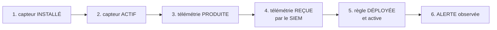

| Niveau | Ce que MADSC en sait | Preuve utilisée |
|---|---|---|
| 1. installé | ✅ | présence du service |
| 2. actif | ✅ **[IMPLÉMENTÉ]** | `Get-Service` → `Running` |
| 3. produite | ⚠️ **[PARTIEL]** | audit configuré + SACL posées — **inférence**, pas mesure |
| 4. reçue | ✅ **[IMPLÉMENTÉ]** | volumes 24 h par source, lus dans l'Indexer |
| 5. déployée | ✅ **[IMPLÉMENTÉ]** | API Wazuh `/rules` : existence, activation, niveau, empreinte, unicité |
| 6. alerte | ✅ **[IMPLÉMENTÉ]** | alertes datées de l'Indexer |

> ### À retenir
>
> ```
> « Sysmon est Running »
>       ≠
> « toutes les attaques seront détectées »
> ```
>
> Un service qui tourne au niveau 2 ne dit **rien** des niveaux 3 à 6. Une règle déployée au
> niveau 5 peut être **muette** si son niveau est sous le seuil `log_alert_level` d'`ossec.conf`
> — MADSC croise d'ailleurs les deux et compte les règles concernées.

> ### Limite
>
> Le niveau 3 (« télémétrie produite ») est le maillon **le plus faible**. MADSC l'infère de la
> configuration d'audit et des SACL. Il ne mesure pas qu'un événement 4662 a effectivement été
> écrit sur ce DC à cet instant.

## Un cas réel qui illustre tout **[VALIDÉ SUR MOGADOR]**

Sur `PMS-01`, le service EventLog est en panne (erreur 13). Conséquence en cascade :

```
SENSOR-EVENTLOG = FAIL sur PMS-01
        ↓
SENSOR-SYSMON ne peut plus rien remonter depuis cet hôte
        ↓
4 scénarios sur 15 passent en DÉGRADÉ
```

Ces deux capteurs expliquent **à eux seuls** les quatre scénarios dégradés. Réparer cet hôte
ferait passer 14 scénarios sur 15 au vert.

### Fichiers principaux

- `collectors/Collect-DetectionSensors.ps1`, `collectors/Collect-AuditPolicy.ps1`
- `backend/coverage.py` (`BASE_SENSORS`, `RULE_SENSOR_REQUIREMENTS`)
- `backend/wazuh.py` (`get_detection_health`, `_HEALTH_SOURCE_FILTERS`)

---

# 10. Structure d'un snapshot

## Exemple simplifié

```json
{
  "host": "DC-01",
  "role": "DC",
  "collector": "Collect-PrivilegedGroups",
  "collector_version": "1.1",
  "collected_at": "2026-08-23T14:50:14Z",
  "controls": [
    {
      "control_id": "PRIV-DOMAIN-ADMINS",
      "observed": { "members": "adm_t0_oussama, Administrateur", "count": 2 },
      "raw": "LDAP IN_CHAIN memberOf (CN=Admins du domaine,CN=Users,DC=mogador,DC=local)"
    }
  ]
}
```

Le snapshot de topologie porte en plus un champ `topology` :

```json
{
  "collector": "Collect-ADTopology",
  "controls": [],
  "topology": {
    "domaine":   { "dns_root": "mogador.local", "dn": "DC=…", "sid": "S-1-5-21-…" },
    "computers": [ … ], "groups": [ … ], "ous": [ … ],
    "principals":    [ { "sid": "…", "dn": "…", "nom": "…", "classe": "user",
                         "gid_primaire": 513 } ],
    "group_members": [ { "groupe_sid": "…", "membres_dn": [ … ],
                         "recuperation_complete": true } ],
    "gpo_report_xml": "…",
    "computers_complets": true, "groupes_complets": true,
    "membres_complets": true, "primaires_collectes": true
  }
}
```

## Les champs, et pourquoi chacun existe

| Champ | Sens | Pourquoi il compte |
|---|---|---|
| `host` | nom **collecté** de la machine | la jointure se fait dessus (§28, alias d'hôtes) |
| `role` | `DC` / `MEMBER` / `WORKSTATION` | détermine l'applicabilité d'un contrôle → `NOT_APPLICABLE` |
| `collected_at` | horloge de **la VM** | comparée à `ingested_at` pour détecter une horloge en dérive |
| `observed` | la mesure | jamais réécrite par MADSC |
| `raw` | la trace de **comment** on a mesuré | c'est lui qui porte le DN interrogé — la corroboration s'en sert (§21) |
| `*_complets` | drapeaux de complétude | transforment une absence en `PARTIELLE` plutôt qu'en zéro |
| `primaires_collectes` | drapeau v1.3 | distingue « non collecté » de « aucun groupe primaire » |

## De la collecte à la posture

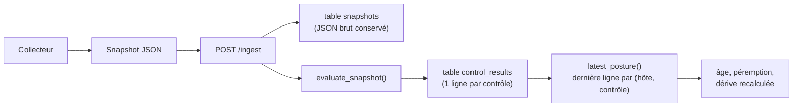

> **À retenir.** Le statut stocké en base est celui calculé **au moment de l'ingestion**.
> `latest_posture()` **recalcule la dérive à la lecture**, contre la baseline **courante** :
> sans cela, un `CHANGED` survivrait à une ré-approbation de baseline et deviendrait un faux
> positif permanent. La ligne stockée reste intacte — c'est la piste d'audit de ce qui était
> vrai à la collecte.

### Fichiers principaux

- `backend/models.py` (schéma du snapshot), `backend/db.py` (`insert_snapshot`, `latest_posture`)
- `data/snapshots/` (dépôt local d'auto-scan)

---

# 11. Ingestion et API

## Les routes

| Route | Méthode | Garde | Rôle |
|---|---|---|---|
| `/` | GET | session | la console — `?view=…&onglet=…&days=…` |
| `/health` | GET | **publique** | sonde ; le runner s'en sert pour vérifier qu'une campagne a atterri |
| `/login`, `/logout` | GET/POST | **publiques** | il faut pouvoir entrer et sortir |
| `/dashboard/static/`, `/assets/` | GET | **publiques** | la page de connexion doit s'afficher |
| `/collectors/<nom>.ps1` | GET | **publique** | amorçage des VM — scripts 100 % lecture, sans secret |
| `/ingest` | POST | **clé d'API** | réception d'un snapshot |
| `/ingest/scan` | POST | **clé d'API** | ingestion des fichiers déposés localement |
| `/baseline/approve` | POST | **clé d'API** | approbation d'une baseline AD |
| `/baseline/rules/approve` | POST | **clé d'API** | approbation des empreintes de règles Wazuh |
| `/changeguard/preflight` | POST | **session** | analyse d'une GPO proposée |
| `/changeguard/appartenance` | POST | **session** | simulation `ADD_MEMBER` |
| `/onboarding/valider` | POST | **session** | validation d'un profil de site collé |
| `/api/posture`, `/api/baseline`, `/api/proofs`, `/api/priorities`, `/api/purpleteam`, `/api/rules/integrity`, `/api/changes/correlation`, `/api/wazuh/*` | GET | session | lectures JSON |
| `/report/direction`, `/report/technique`, `/report/ecart` | GET | session | rapports PDF |

## Les deux mécanismes de garde

```
clé d'API (X-MADSC-Key)   →   pour les MACHINES : collecteurs, approbations
session (cookie)          →   pour les HUMAINS : console, préflights
```

**Pourquoi deux ?** Exiger la clé machine pour une action humaine obligerait à distribuer un
secret machine à chaque opérateur. Exiger une session d'un collecteur est impossible : il n'en
a pas et ne peut pas en avoir.

Les trois POST « humains » (`/changeguard/*`, `/onboarding/valider`) **n'écrivent rien** : ils
lisent, analysent, rendent, puis oublient. Ils sont POST uniquement parce qu'un rapport GPO ou
deux SID ne tiennent pas confortablement dans une URL.

> **Un filet de test qui a déjà servi.** `tests/test_api_key.py` recense **toutes** les routes
> POST/PUT/PATCH/DELETE et exige que chacune soit gardée **ou explicitement tolérée avec sa
> raison**. Il a rattrapé `/login` et `/logout` le jour de leur ajout, puis
> `/changeguard/appartenance`. Un second test vérifie que les routes tolérées sont bien
> couvertes par la **session** — tolérer l'absence de clé n'est pas tolérer l'absence de garde.

## Décodage du corps

Les POST de formulaire décodent le corps avec `parse_qs` de la bibliothèque standard plutôt que
`Form(...)` de FastAPI, qui exigerait `python-multipart` — une dépendance de plus à installer
sur un serveur qui fonctionne.

### Fichiers principaux

- `backend/main.py` (toutes les routes, `_PUBLIC_PATHS`, `_MACHINE_PATHS`, `require_api_key`)
- `backend/auth.py` (session, jeton)
- `tests/test_api_key.py`, `tests/test_login.py`

---

# 12. Base de données

**SQLite**, fichier unique `data/madsc.db`.

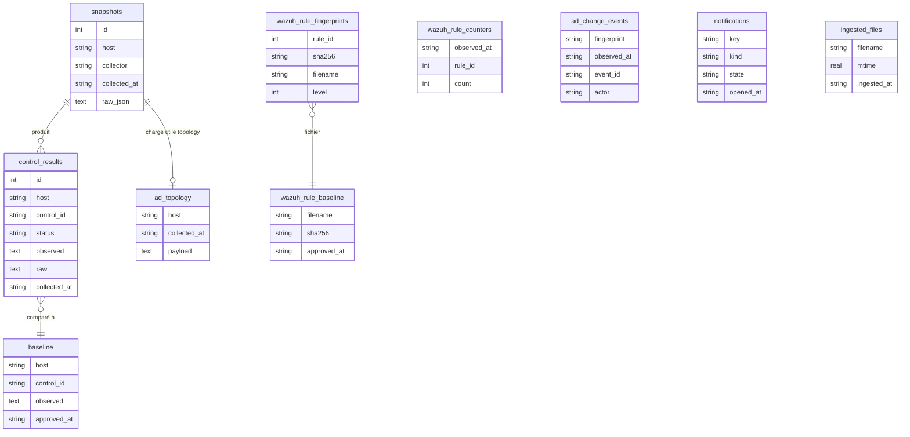

## Les tables, une par une

| Table | Rôle | Qui écrit | Qui lit | Conservation |
|---|---|---|---|---|
| `snapshots` | JSON brut reçu, intact | `/ingest` | audit, rejeu | non bornée |
| `control_results` | une ligne par contrôle mesuré | ingestion | **toutes les pages** | non bornée (historique de tendance) |
| `baseline` | valeurs **approuvées** par un humain | `/baseline/approve` | calcul de dérive | jusqu'à ré-approbation |
| `ad_topology` | charge utile `topology` (~500 Ko) | `/ingest` | `ad_model`, ChangeGuard | **bornée** (`MADSC_TOPOLOGY_RETENTION`, défaut 10) |
| `wazuh_rule_counters` | compteurs cumulés par règle | lecture Wazuh | tendance, deltas | non bornée |
| `wazuh_rule_fingerprints` | empreinte SHA-256 par règle | approbation | intégrité | jusqu'à ré-approbation |
| `wazuh_rule_baseline` | empreinte par **fichier** de règles | approbation | intégrité | idem |
| `ad_change_events` | événements AD dédupliqués par empreinte | lecture Indexer | Corrélation | non bornée |
| `notifications` | conditions ouvertes/résolues | moteur de notification | dédoublonnage | tant qu'ouvertes |
| `ingested_files` | `mtime` des fichiers déjà lus | `/ingest/scan` | évite la double ingestion | permanent |

> **Pourquoi `ad_topology` est bornée et pas les autres.** Chaque relevé embarque le rapport XML
> de **toutes** les GPO du domaine — environ 500 Ko ici. Sans cette borne, deux collectes par
> jour ajouteraient ~1 Mo par jour. Dix relevés couvrent cinq jours à deux collectes
> quotidiennes, de quoi relire un préflight récent.

> **Limite [LIMITE]** — SQLite est mono-processus en écriture et ne convient pas à plusieurs
> consoles concurrentes ni à un gros parc. Voir §38.

### Fichiers principaux

- `backend/db.py` (`init_db`, `latest_posture`, `latest_topology`, `_age_hours`)

---

# 13. Les contrôles de sécurité

## Qu'est-ce qu'un contrôle ?

Une **question mesurable** sur la configuration, avec une valeur attendue ou une baseline.

**41 contrôles**, répartis en 11 catégories :

| Catégorie | Nb | Catégorie | Nb |
|---|---|---|---|
| Protocoles | 7 | Groupes privilégiés | 5 |
| Stratégies de groupe | 5 | Délégation | 4 |
| Détection | 4 | Tiering | 4 |
| LAPS | 3 | Mots de passe | 3 |
| Télémétrie & Audit | 3 | Active Directory | 2 |
| Services système | 1 | | |

Applicabilité : **23** au DC seul, **12** partout, **6** aux membres/postes.
Sévérité : **17** Critique, **19** Élevé, **5** Moyen.

## Anatomie, sur quatre exemples réels

### Un contrôle de protocole — attente fixe

```
control_id  PROTO-SMB-SIGNING-SERVER
expected    { "RequireSecuritySignature": 1 }
observed    { "RequireSecuritySignature": 1 }
status      PASS
raw         HKLM\SYSTEM\...\LanmanServer\Parameters
```

### Un contrôle de groupe privilégié — baseline seule

```
control_id  PRIV-DOMAIN-ADMINS
expected    None                      ← baseline-only
observed    { "members": "adm_t0_oussama, Administrateur", "count": 2 }
raw         LDAP IN_CHAIN memberOf (CN=Admins du domaine,CN=Users,DC=mogador,DC=local)
status      PASS (conforme à la baseline approuvée)
```

**11 contrôles sur 41** sont ainsi en `expected = None` : aucune valeur universelle n'existe
pour « qui doit être administrateur du domaine ». Seule la **dérive** a du sens.

### Un contrôle de capteur

```
control_id  SENSOR-EVENTLOG
expected    { "state": "Running" }
observed    { "state": "Stopped" }     ← PMS-01
status      FAIL
```

### Un contrôle inapplicable

```
control_id  LOCAL-ADMINS-MEMBERS   sur DC-01
status      NOT_APPLICABLE
detail      « Applicable aux serveurs membres et postes uniquement (pas au DC) »
```

## Les états — vérifiés dans le code

| État | Sens | Compte dans le score ? |
|---|---|---|
| `PASS` | conforme à l'attente **ou** à la baseline | ✅ numérateur |
| `FAIL` | mesuré, et différent de l'attendu | ✅ dénominateur |
| `CHANGED` | dérive depuis la baseline approuvée | ✅ dénominateur |
| `NOT_EVALUATED` | non mesuré, non collecté, périmé, ou baseline absente | ❌ mais **reste au dénominateur total** → fait chuter la couverture |
| `NOT_APPLICABLE` | sans objet pour ce rôle d'hôte | ❌ **sort des deux** |

> **Un sixième état existe à l'affichage seulement.** `NOT_COLLECTED` est produit par la vue
> Conformité pour une case dont aucune ligne n'a été mesurée alors que le contrôle concerne bien
> cet hôte. **Il n'existe pas en base** — le chercher dans `evaluate.py` serait vain.

### Fichiers principaux

- `backend/controls.py` (le catalogue `CATALOG`)
- `backend/evaluate.py` (`evaluate_conformity`, `resolve_drift`, `_evaluate_one`)

---

# 14. Évaluation et score

## Comment un contrôle est évalué

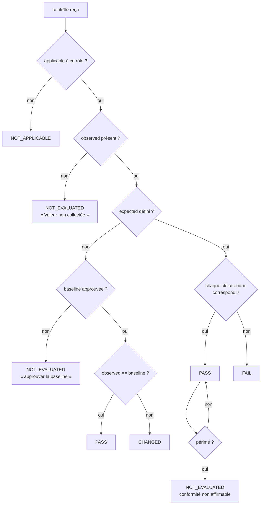

## Le score pondéré

Six catégories, pondérées :

| Catégorie | Poids | Contrôles |
|---|---|---|
| Identity & Access | 20 | 15 |
| Protocol Security | 20 | 5 |
| Logging & Monitoring | 20 | 3 |
| Architecture & Tiering | 15 | 8 |
| Detection & Response | 15 | 4 |
| Attack Surface | 10 | 6 |

```
score_catégorie = 100 × PASS / (PASS + FAIL + CHANGED)
couverture      = Σ poids des catégories MESURÉES / Σ poids total
score global    = Σ (score_cat × poids) / Σ poids mesurés     SI couverture ≥ 50 %
                  None                                        SINON
```

## Exemple chiffré

```
Identity & Access     12 PASS / 15 évalués     → 80 %   poids 20
Protocol Security      5 PASS /  5 évalués     → 100 %  poids 20
Logging & Monitoring   3 PASS /  3 évalués     → 100 %  poids 20
Architecture           7 PASS /  8 évalués     → 88 %   poids 15
Detection              2 PASS /  4 évalués     → 50 %   poids 15
Attack Surface        rien de mesuré           → indisponible, poids 10

couverture = (20+20+20+15+15) / 100 = 90 %  ≥ 50 %  → score affichable
score = (80×20 + 100×20 + 100×20 + 88×15 + 50×15) / 90 = 87 %
```

Si seules **Detection** et **Attack Surface** avaient été mesurées :

```
couverture = 25 / 100 = 25 %  < 50 %   →  score = « Non évalué »
                                          + dernier score probant DATÉ
```

## Pourquoi un score peut devenir « Non évalué »

| Cause | Signal |
|---|---|
| couverture < 50 % | mesures manquantes ou périmées → **relancer les collecteurs** |
| `politique_non_approuvee` | mode découverte, aucun profil de site → **poser `MADSC_SITE_CONFIG`** |

> ### À retenir
>
> **Un score absent n'est pas un score de zéro.** Un `0` en rouge se lirait « Critical » alors
> que la réalité est « je n'ai rien pu mesurer ». Ce défaut a réellement existé : le rapport
> direction affichait une jauge **0 % en rouge** sur une base vide, pendant que la console
> disait « Non évalué » sur les mêmes données. C'est le document qui **sort du bâtiment** qui
> portait la version fausse.

## Ce que le score mesure réellement

```
le score mesure      la part des contrôles MESURÉS qui sont conformes,
                     pondérée par catégorie

le score NE mesure   ni la sécurité absolue,
PAS                  ni ce qui n'est pas dans le catalogue,
                     ni la qualité de la détection réelle,
                     ni la résistance à une attaque
```

> **Pour la soutenance.** « 97 % » ne veut pas dire « sûr à 97 % ». Cela veut dire : *sur les
> 41 questions que MADSC sait poser, et parmi celles qu'il a pu mesurer, 97 % ont la réponse
> attendue.*

### Fichiers principaux

- `backend/evaluate.py` (`MIN_MEASURED_COVERAGE = 0.5`, `conformity_rate`)
- `dashboard/services/dashboard_service.py` (`_score_from_rows`)
- `dashboard/data/security_score.json` (catégories et poids)
- `tests/test_score_honesty.py`

---

# 15. Baseline et assurance de dérive

## Pourquoi une baseline existe

Certaines questions n'ont **aucune réponse universelle**. « Qui doit être administrateur du
domaine ? » dépend de l'organisation. Mais une fois la réponse **approuvée**, tout changement
mérite d'être vu.

```
attente fixe (expected)   →  « cette valeur est bonne partout »       ex. SMB signing = 1
baseline                  →  « cette valeur a été approuvée ICI »     ex. membres de DA
```

## Le cycle

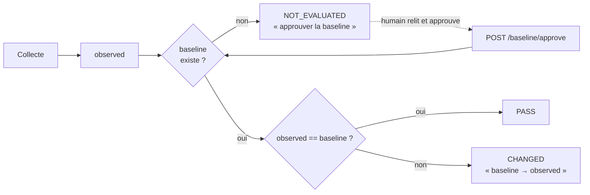

## Deux contrôles par thème — et pourquoi

C'est une règle de conception explicite : **une attente fixe ET un contrôle baseline-only**.

| | Détecte | Aveugle à |
|---|---|---|
| attente fixe | la **disparition** du contrôle, même sans baseline | la modification fine |
| baseline-only | toute **modification** de composition | la disparition du contrôle lui-même |

L'un sans l'autre est aveugle la moitié du temps.

## Le piège de l'ordre des clés

Les tables de hachage PowerShell **n'ont pas d'ordre garanti**. Comparer deux chaînes JSON
produirait de fausses dérives à chaque collecte. MADSC compare donc **après
désérialisation** — jamais des chaînes.

## Le piège de la dérive figée

Le statut stocké fige la baseline **d'alors**. `latest_posture()` recalcule donc la dérive
contre la baseline **courante** : sans cela, un `CHANGED` survivrait à une ré-approbation et
deviendrait un faux positif permanent.

### Fichiers principaux

- `backend/evaluate.py` (`resolve_drift`, `comparable`)
- `backend/db.py` (`latest_posture`, table `baseline`)
- `tests/test_member_ordering.py`, `tests/test_evaluate.py`

---

# 16. Le modèle AD

## Ce que c'est

Une **projection en lecture seule** de l'annuaire : aucune table, aucun cache, **reconstruite
à chaque appel**. Elle ne conclut rien ; elle décrit.

## Les entités

| Entité | Source | Champs |
|---|---|---|
| Domaine | `Get-ADDomain` | `dns_root`, `dn`, `sid` |
| Unité d'organisation | `Get-ADOrganizationalUnit` | `dn`, `nom`, **`tier` (DÉCLARÉ)** |
| Ordinateur | `Get-ADComputer` | `nom`, `sid`, `dn`, OS, `tier`, `role` |
| Groupe | `Get-ADGroup` | `sid`, `nom`, **`portee`**, `categorie`, `dn` |
| Principal | ADSI `(objectSid=*)` | `sid`, `dn`, `nom` (=`sAMAccountName`), `classe`, `gid_primaire` |
| GPO | `Get-GPOReport` | `nom`, `guid`, `liens`, `permissions`, `reglages` |

> **Pourquoi la `portee` du groupe est collectée.** Rien dans un SID ne dit qu'un principal est
> un groupe de domaine local. Sans cet inventaire, ChangeGuard classerait AGDLP **par convention
> de nommage** (préfixe `DL_`) et le dirait ; avec lui, il **mesure**.

## Le modèle, en un schéma

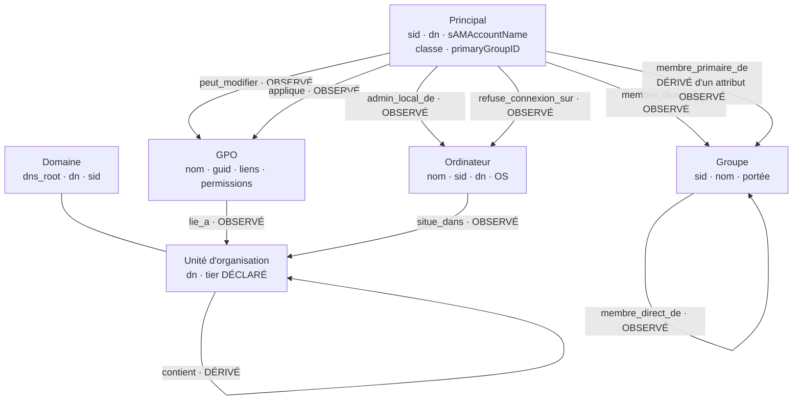

> Le rayon d'impact **GPO → machine** n'est **pas** une arête : c'est un calcul
> (lien → unité → sous-arbre → machines). Le figer le placerait à côté de faits observés tout
> en pouvant devenir faux dès qu'une machine bouge.

## Les relations

Chaque relation rend `(arêtes, couverture)` — **jamais une simple liste**.

| Relation | Direction | Provenance | Source | Utilisation |
|---|---|---|---|---|
| `situe_dans` | ordinateur → OU | OBSERVÉ | `Get-ADComputer` (DN) | portée d'un lien GPO |
| `contient` | OU → OU parente | DÉRIVÉ | découpage du DN | arborescence |
| `lie_a` | GPO → OU | OBSERVÉ | `Get-GPOReport` (LinksTo) | rayon d'impact |
| `peut_modifier` | principal → GPO | OBSERVÉ | descripteur de sécurité | **Preflight : capacité GPO** |
| `applique` | principal → GPO | OBSERVÉ | filtrage de sécurité | affiché, **pas un privilège** |
| `admin_local_de` | principal → ordinateur | OBSERVÉ | `LOCAL-ADMINS-MEMBERS` | **Preflight : admin local** |
| `refuse_connexion_sur` | principal → ordinateur | OBSERVÉ | `TIER-DENY-LOGON-PRINCIPALS` | **annotation garde-fou** |
| `membre_de` | principal → groupe (par **nom**) | OBSERVÉ | `PRIV-*` | source historique, **corroboration** |
| `membre_direct_de` | principal → groupe (SID) | OBSERVÉ | `member;range` | le graphe |
| `membre_primaire_de` | principal → groupe (SID) | **DÉRIVÉ d'un attribut OBSERVÉ** | `primaryGroupID` | le graphe (v1.3) |
| `membre_effectif_par_member` | fermeture | DÉRIVÉ | `member` seul | **corroboration uniquement** |
| `membre_effectif_avec_groupes_primaires` | fermeture | DÉRIVÉ | `member` + primaire | **modèle AD, Preflight** |

## Ce que le modèle ne représente PAS, et pourquoi

- **GPO → machine** : le rayon d'impact est un **calcul** (lien → unité → sous-arbre →
  machines). Le figer en arête le placerait à côté de faits observés tout en pouvant devenir
  faux dès qu'une machine bouge. Il reste une **requête**.
- **Les ACL générales d'annuaire** (`GenericAll`, `WriteDacl`, DCSync, RBCD) — voir §37.

### Fichiers principaux

- `backend/ad_model.py`, `backend/adtopology.py`, `backend/gposettings.py`
- `collectors/Collect-ADTopology.ps1`
- `dashboard/controllers/environnement_controller.py`

---

# 17. Provenance

Quatre valeurs, et elles n'engagent pas la même confiance.

| Provenance | Sens | Exemple réel |
|---|---|---|
| **OBSERVÉ** | lu dans l'annuaire ou un rapport | `member` d'un groupe ; DN d'un ordinateur ; lien d'une GPO |
| **DÉRIVÉ** | calculé depuis un observé | OU parente (découpage du DN) ; **fermeture transitive** |
| **DÉCLARÉ** | décidé par un humain dans `config/*.toml` | le **tier** d'une unité |
| **DÉRIVÉ d'un attribut OBSERVÉ** | reconstruit depuis une valeur lue | **`primaryGroupID` → SID du groupe** |

## Pourquoi la quatrième existe **[IMPLÉMENTÉ v1.3]**

Les trois premières ne convenaient pas à l'appartenance par groupe primaire :

- ce n'est pas `OBSERVÉ` — **rien** dans l'annuaire ne porte le SID du groupe primaire ; il est
  **calculé** ;
- ce n'est pas `DÉRIVÉ` au sens de la fermeture transitive, qui ne part que de faits **déjà
  indexés par SID** : ici la valeur de départ (`primaryGroupID = 513`) est bel et bien **lue**.

> **Confondre les deux ferait passer une reconstruction pour une lecture.**

## Exemple de chaîne mixte **[VALIDÉ SUR MOGADOR]**

```
DC-01$
  ↓ groupe primaire · DÉRIVÉ depuis primaryGroupID OBSERVÉ
Contrôleurs de domaine
  ↓ membre direct · OBSERVÉ
Groupe de réplication dont le mot de passe RODC est refusé
```

Chaque saut porte **son** mécanisme. Un pas primaire ne se fait jamais passer pour une lecture
de `member`.

### Fichiers principaux

- `backend/ad_model.py` (`OBSERVE`, `DERIVE`, `DECLARE`, `DERIVE_D_OBSERVE`)

---

# 18. Couverture

## Les trois états

| État | Répond à « puis-je conclure de l'absence ? » |
|---|---|
| `COMPLETE` | **oui** — la source couvre tout le périmètre, une absence est une absence |
| `PARTIELLE` | **seulement dans `portee`** ; au-delà, on ne sait pas |
| `INCONNUE` | **non** — rien n'a été collecté, l'absence n'apprend rien |

## Le tableau qui résume tout

| Arêtes rendues | Couverture | Lecture correcte |
|---|---|---|
| 0 | `COMPLETE` | **il n'y en a réellement aucune** |
| 0 | `INCONNUE` | **NON COLLECTÉ** — ne rien conclure |
| 12 | `PARTIELLE` | ces 12 sont vraies ; il peut y en avoir d'autres |
| 46 | `COMPLETE` | ce sont exactement les 46 qui existent |

> **À retenir.** *Une liste vide accompagnée d'une couverture inconnue se lit « je ne sais
> pas », jamais « il n'y en a pas ».*

## Ce qui dégrade une couverture

| Cause | Effet |
|---|---|
| troncature `MaxValRange` non prouvée complète | `COMPLETE` → `PARTIELLE` |
| DN de membre non résolu | `COMPLETE` → `PARTIELLE` |
| cycle d'imbrication détecté | `COMPLETE` → `PARTIELLE` (sur la fermeture) |
| relevé **périmé** (> 72 h par défaut) | `COMPLETE` → `PARTIELLE` |
| hôte n'ayant jamais collecté ce contrôle | `COMPLETE` → `PARTIELLE` |

## Composition de couverture (v1.3) **[IMPLÉMENTÉ]**

Le graphe enrichi combine deux sources de preuve. Sa couverture les **compose** :

```
member COMPLETE  +  primaire COMPLETE          →  COMPLETE
une source utilisable + une INCONNUE/PARTIELLE →  PARTIELLE
les deux indisponibles                          →  INCONNUE
```

**Pourquoi la ligne du milieu compte.** Un relevé antérieur à la v1.3 porte 46 arêtes `member`
parfaitement complètes et **aucune** appartenance primaire — parce qu'on ne les a pas lues.
`COMPLETE` présenterait un graphe amputé comme concluant ; `INCONNUE` jetterait 46 relations
qu'on connaît. **`PARTIELLE` dit ce qui est vrai.**

C'est ce qui empêche un vieux relevé de produire « aucun privilège nouveau » avec aplomb.

### Fichiers principaux

- `backend/ad_model.py` (classe `Couverture`, `composer_couverture`, `_degrader_si_perime`)
- `tests/test_ad_model_projections.py`

---

# 19. Identity Graph

## Le pipeline complet

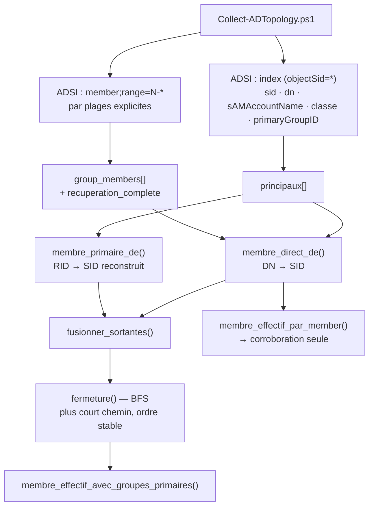

## Pourquoi le SID

Le domaine est en français et des groupes **ont déjà été renommés**. Un graphe indexé par nom
aurait cassé silencieusement.

## `member` et la limite `MaxValRange`

L'attribut `member` est borné par **MaxValRange** (1500 par défaut sur Windows Server) : au-delà,
l'annuaire renvoie une liste **tronquée SANS erreur**.

> **Pourquoi c'est grave.** Un graphe de privilèges tronqué **sous-estime les droits tout en
> ayant l'air complet** — exactement le mode de défaillance que MADSC refuse.

Le collecteur fait donc la récupération par plages **explicitement** : `member;range=0-*`, puis
`member;range=N-*`, jusqu'à ce que l'annuaire signale la fin par une plage terminée par `*`.
C'est ce suffixe `-*` qui prouve la fin, **et lui seul**.

> **Nuance importante.** Rien ne prouve, sur une version donnée du module ActiveDirectory, que
> `Get-ADGroup -Properties member` fasse la récupération par plages. Plutôt que de parier
> là-dessus, MADSC la fait lui-même — et la boucle est **vérifiable dans le fichier**.

## Trois cas de résolution, et aucun n'est jeté

| Cas | Traitement |
|---|---|
| DN présent dans l'index | identité sûre |
| **principal de forêt approuvée** (FSP) | son DN **porte le SID** (`CN=S-1-5-…`) → conservé. L'écarter masquerait un privilège accordé depuis une forêt approuvée |
| **DN pendant** (objet supprimé) | conservé, non résolu, **avec sa raison**. Le supprimer ferait disparaître une appartenance réelle |

## Cycles

Un cycle d'imbrication est **légal dans AD**. Le parcourir sans mémoire boucle indéfiniment ; le
tronquer en silence **sous-estime** l'appartenance effective. MADSC le détecte, l'arrête, et le
**signale** dans la couverture.

## Parcours en largeur, déterministe

Le parcours est un **BFS** : `profondeur` est la distance **minimale** et le chemin enregistré
est un **plus court chemin**. Les voisins sont parcourus par **SID trié**.

> **Pourquoi ce n'était pas indifférent.** La version d'origine utilisait une pile. Les arêtes de
> profondeur 1 en sortaient toujours justes, mais une profondeur ≥ 2 pouvait être **surévaluée**.
> Tant que la fermeture ne servait qu'à **compter**, cela ne se voyait pas. Elle sert désormais à
> **expliquer** — un détour de trois sauts là où il en existe deux est vrai et trompeur à la fois.
>
> Le passage en largeur a été **mesuré neutre avant d'être fait** : 0 écart sur les 56 arêtes.

## Déduplication `member` vs primaire

Quand les deux mécanismes attestent la **même paire**, l'appartenance effective est comptée
**une fois**, et `member` — la preuve la plus directe — porte le chemin affiché. L'attestation
primaire reste consultable dans `membre_primaire_de()`.

## Les chiffres mesurés **[VALIDÉ SUR MOGADOR — 23 août 2026]**

```
principaux                       89
arêtes member directes           46
arêtes primaires                 18
effectives « member » seul       56
effectives enrichies             89
profondeur maximale               3
cycles                            0
principaux non résolus            0
groupes tronqués (MaxValRange)    0
```

## Deux chaînes réelles

```
adm_t1_oussama  →  GG_T1_Server_Admins  →  DL_PMS01_LocalAdmins
adm_t0_oussama  →  GG_T0_Admins  →  Admins du domaine  →  Administrateurs
```

### Fichiers principaux

- `backend/ad_model.py` (`fermeture`, `sortantes_depuis`, `fusionner_sortantes`, `atteint`)
- `collectors/Collect-ADTopology.ps1` (`Get-MembresParPlages`)
- `tests/test_ad_model_membres.py`, `tests/test_ad_model_projections.py`

---

# 20. `primaryGroupID`

## Le problème, simplement

Ouvrez `Utilisateurs du domaine` dans la console AD : il paraît **vide**. Pourtant tous les
comptes en sont membres.

**Pourquoi ?** Active Directory ne place **pas** l'appartenance au groupe primaire dans
l'attribut `member` du groupe, ni dans le `memberOf` du compte. Elle vit dans un attribut du
**compte** : `primaryGroupID`, qui porte un **RID**.

## Pourquoi cela touchait MADSC deux fois

```
Collect-ADTopology       lit `member` par plages        →  ne la voit pas
Collect-PrivilegedGroups lit memberOf via IN_CHAIN      →  ne la voit pas non plus
```

Les **deux** sources étaient aveugles de la même façon. Leur accord ne prouvait donc rien sur
ce point.

Et depuis le Privilege Preflight, cela touchait aussi la **justesse du delta** : une capacité
déjà détenue par le groupe primaire était décrite comme **NOUVELLE**.

## La reconstruction **[IMPLÉMENTÉ v1.3]**

```
préfixe du SID DU PRINCIPAL  +  RID observé  →  SID du groupe cible

S-1-5-21-2162308186-1945532421-2260539108-1103   principal
S-1-5-21-2162308186-1945532421-2260539108        préfixe
                                          + 513
S-1-5-21-2162308186-1945532421-2260539108-513    cible
```

**Le préfixe vient du SID du compte, pas du SID du domaine.** `primaryGroupID` est un RID
relatif au domaine du **compte** ; partir du compte est exact dans le cas général **et** offre
une contre-vérification gratuite contre le domaine collecté.

**Aucun nom ne participe jamais à la reconstruction** — la fonction ne reçoit que des SID et un
RID, elle n'a donc aucun libellé sous la main.

## Six classes d'échec, aucune réparée par un nom

```
attribut_absent            rid_invalide              sid_non_decomposable
hors_domaine_collecte      groupe_reconstruit_absent cible_non_groupe
```

L'arête est **conservée** avec son motif plutôt que jetée : la jeter ferait disparaître une
appartenance dont on sait qu'elle existe, faute de savoir vers **quoi**.

## `NON COLLECTÉ ≠ zéro`

Un relevé antérieur à la v1.3 ne porte pas le drapeau `primaires_collectes` : la relation rend
`INCONNUE`. Rendre « 0 appartenance primaire » affirmerait qu'aucun compte n'en a — **faux pour
tout domaine**, l'attribut étant obligatoire dans AD.

## La distribution mesurée **[VALIDÉ SUR MOGADOR]**

```
UTILISATEURS                           ORDINATEURS
14 × RID 513  Utilisateurs du domaine    2 × RID 515  Ordinateurs du domaine
 1 × RID 514  Invités du domaine         1 × RID 516  Contrôleurs de domaine

total : 18   ·   couverture COMPLETE   ·   0 échec de reconstruction
```

Deux enseignements que la mesure a apportés **avant** l'écriture d'une ligne de code :

- tous les comptes ne pointent pas vers 513 — `Invité` pointe vers **514** ;
- les ordinateurs ne sont pas uniformes — `DC-01` pointe vers **516**, les deux autres vers 515.

> **Collecter les ordinateurs était donc nécessaire, pas du confort.**

## Le cas `DC-01` — la démonstration la plus nette

```
DC-01$
 → primaryGroupID 516
Contrôleurs de domaine
 → member
Groupe de réplication dont le mot de passe RODC est refusé
```

Cette chaîne de **profondeur 2 est totalement absente** de la projection `member` seule : zéro
arête pour ce compte machine.

### Fichiers principaux

- `backend/ad_model.py` (`reconstruire_sid_primaire`, `membre_primaire_de`)
- `collectors/Collect-ADTopology.ps1`
- `tests/test_ad_model_primaire.py`

---

# 21. Corroboration

## L'idée

MADSC observe **deux fois** la même chose — la population effective d'un groupe privilégié —
par deux mécanismes qui ne partagent ni requête, ni chemin de code, ni clé d'identité.

```
SOURCE A   Collect-PrivilegedGroups
           LDAP_MATCHING_RULE_IN_CHAIN sur memberOf
           → membres effectifs, utilisateurs seulement, par sAMAccountName
           → À PLAT : aucune structure d'imbrication

SOURCE B   Collect-ADTopology
           member par plages + fermeture transitive
           → appartenances DIRECTES observées, par SID
           → imbrication DÉRIVÉE, rejouable
```

La question posée est **la seule** que deux observations indépendantes permettent :
**décrivent-elles la même population ?**

## Trois états — et pas `CONFORME`

```
CONCORDANT       même population sur le périmètre comparable
DIVERGENT        comparables, populations DIFFÉRENTES
NON COMPARABLE   une condition de comparabilité manque
```

> **On ne teste pas une politique de sécurité ici, on teste deux relevés l'un contre l'autre.**
> Le résultat est une **métadonnée de qualité de preuve** : aucun effet sur les verdicts, la
> baseline, le score, les priorités ou les notifications.

## Les portes de comparabilité

| Porte | Refus si |
|---|---|
| sources | plusieurs hôtes rapportent le même contrôle ; graphe non collecté |
| couverture | fermeture effective ≠ `COMPLETE` (absorbe troncature, DN non résolus, cycles **et** péremption) |
| fraîcheur | relevé `PRIV-*` périmé |
| **même horloge** | les deux relevés viennent d'hôtes **différents** |
| **contemporanéité** | Δ > `MADSC_CORROBORATION_WINDOW_HOURS` (**1 h** par défaut) |
| cible | DN illisible, absent, pas un groupe, hors domaine, RID connu incohérent |
| identité | un `sAMAccountName` résout à 0 ou ≥ 2 principaux |

## Comment l'identité est résolue

```
observed["members"].split(",")   →  sAMAccountName
        ↓  correspondance EXACTE et UNIQUE (casse ignorée)
index des principaux             →  SID
```

**Interdits, chacun sous test :** pas de `displayName`, pas de `cn`, pas de correspondance
partielle, **pas de normalisation d'accents** (`Invité` ≠ `Invite`).

> **Le découpage sur la virgule est sûr, et ce n'est pas une chance :** la virgule fait partie
> des caractères **interdits** dans un `sAMAccountName`. Le `-join ', '` du collecteur est donc
> réversible sans perte.

## Le groupe cible

Identifié par le **DN exact inscrit dans `raw`** par le collecteur — donc l'objet que la source
A a réellement interrogé. Le RID bien connu ne sert qu'à **contre-vérifier** :

| Contrôle | RID attendu | Contre-vérifiable |
|---|---|---|
| `PRIV-DOMAIN-ADMINS` | `-512` | ✅ |
| `PRIV-ENTERPRISE-ADMINS` | `-519` | ✅ |
| `PRIV-SCHEMA-ADMINS` | `-518` | ✅ |
| `PRIV-BUILTIN-ADMINS` | `S-1-5-32-544` | ✅ |
| `PRIV-GG-T0-ADMINS` | *(groupe de site)* | ❌ — et c'est **affiché** |

## Hors périmètre comparable, jamais une divergence

La requête de la source A est `(objectCategory=person)(objectClass=user)` : elle **ne peut pas**
rendre un principal de forêt approuvée, un ordinateur ou un groupe. Les compter en
`only_in_graph` fabriquerait un `DIVERGENT` **permanent** sur tout domaine ayant une approbation.

## Le résultat opérationnel **[VALIDÉ SUR MOGADOR — 23 août 2026]**

```
PRIV-*      2026-08-23T14:50:14Z     par DC-01
topologie   2026-08-23T14:50:17Z     par DC-01
Δ           3 secondes

5 concordant · 0 divergent · 0 non comparable
```

## `CONCORDANT` ne veut pas dire « complet »

C'est **le point le plus subtil** de cette section, et il a changé avec la v1.3 :

| | |
|---|---|
| **avant v1.3** | `primaryGroupID` était un **angle mort du graphe d'identités** |
| **après v1.3** | MADSC l'**observe**. Il reste hors du périmètre comparable parce que `PRIV-*` utilise `LDAP IN_CHAIN`, qui ne peut pas le voir |

**Ce sont deux affirmations différentes.** C'est désormais une **asymétrie entre les deux
mécanismes comparés**, non plus une lacune de MADSC. Le texte de la réserve **suit l'état réel
de la collecte** : sur un relevé pré-v1.3, l'ancien énoncé reste vrai et reste affiché.

> ```
> CONCORDANT signifie « les deux mécanismes s'accordent sur le périmètre comparable »
>            et JAMAIS « la population privilégiée est prouvée complète »
> ```

### Fichiers principaux

- `backend/corroboration.py`
- `tools/verifier_corroboration.py` (vérification après campagne, code de sortie 0/2)
- `tests/test_corroboration.py`

---

# 22. ChangeGuard — idée générale

## Le problème

Une configuration peut être **syntaxiquement correcte** et **dangereuse dans cet
environnement-ci**.

```
« RequireSecuritySignature = 1 »   →  correct partout
mais lié à la racine du domaine    →  peut couper la signature SMB
                                       si l'héritage est bloqué ailleurs
```

## La réponse

**ChangeGuard = préflight sans application.** Il répond à *« que produirait ce changement,
ICI ? »* sans rien modifier.

C'est la **troisième question** du produit :

```
Évaluation de sécurité   ma configuration est-elle sûre ?
Assurance de dérive      a-t-elle changé ?
ChangeGuard              ce changement serait-il sûr ICI ?     ← nouveau
```

## Deux branches **[IMPLÉMENTÉ]**

```
/?view=changeguard                       →  onglet Préflight GPO (défaut)
/?view=changeguard&onglet=appartenance   →  onglet Appartenance AD
```

Onglets **rendus par le serveur** — de simples liens, l'état dans l'URL. Ni JavaScript, ni
bascule CSS. Une valeur d'onglet inconnue retombe sur GPO : qui utilisait ChangeGuard avant
retrouve exactement son écran.

### Fichiers principaux

- `backend/changeguard.py` (GPO), `backend/privilege_preflight.py` (appartenance)
- `dashboard/controllers/changeguard_controller.py`

---

# 23. ChangeGuard GPO

## Le flux

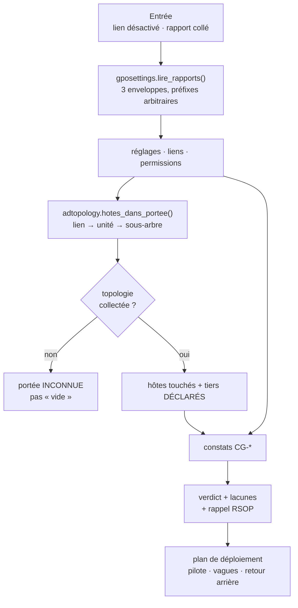

## Quatre entrées

| Entrée | Question |
|---|---|
| **liens de GPO désactivés** | qu'est-ce qui est à un clic de reprendre effet ? |
| **conflits de stratégie** | quels réglages sont écrits différemment sur une machine commune ? |
| **stratégie proposée** | un rapport collé, analysé contre l'unité désignée |
| **plan de déploiement** | pilote, vagues, vérifications, retour arrière |

## Cinq constats **[IMPLÉMENTÉ]**

```
CG-AGDLP               contournement de la chaîne AGDLP
CG-PORTEE-MULTI-TIER   un lien touche plusieurs zones de sécurité
CG-AUDIT-AVEUGLE       le changement rend une règle SIEM muette
CG-AUDIT-PARTIEL       idem, partiellement
CG-CAPTEUR-DESACTIVE   un capteur serait désactivé
```

## Ce qu'il ne fait JAMAIS : le RSOP **[LIMITE]**

**Aucun vainqueur n'est désigné entre deux stratégies.** L'ordre des liens, l'héritage bloqué,
les filtres WMI et le bouclage **ne sont pas modélisés**. Tout verdict porte le rappel de
vérifier en RSOP.

> **Pourquoi c'est un choix et pas une paresse.** Un vainqueur calculé de travers serait
> **plausible et faux** — donc pire que pas de vainqueur.

## Deux constats réels **[VALIDÉ SUR MOGADOR]**

**1. `T1_AddAdmin_PMS`** — lien désactivé qui, réactivé, redonnerait à `adm_t1_oussama` une
administration locale **directe** sur PMS-01. Le contournement AGDLP est **mesuré** : le compte
est absent de l'inventaire complet des groupes, donc ce n'est **pas** un groupe.

**2. Conflit SMB** — `Default Domain Policy` demande la signature SMB à **0** à la racine
pendant que `GPO_SMB_Signing_Required` la demande à **1** sur trois unités.

```
la valeur mesurée est 1
        MAIS par PRÉSÉANCE, pas parce que les stratégies s'accordent
        ↓
bloquer l'héritage ou imposer le lien racine
        → couperait la signature SMB PARTOUT
```

> **Pour la soutenance.** C'est l'exemple parfait : une **conformité obtenue par accident**
> reste une conformité fragile. Un scanner aurait affiché « conforme » et se serait tu.

## Trois pièges de format découverts en exécution

Tous sous test, tous susceptibles de revenir sur un autre domaine :

- le **préfixe d'espace de nommage** d'un rapport GPO est arbitraire (`q1`, `q2`, `q3` dans un
  même fichier) ;
- l'**enveloppe** varie selon l'appel (`<report>`, `<GPOS>`, ou aucune) ;
- `Get-GPOReport -All` peut rendre une **LISTE** de documents plutôt qu'un seul.

### Fichiers principaux

- `backend/changeguard.py`, `backend/gposettings.py`
- `tests/test_changeguard.py`, `tests/test_gposettings.py`

---

# 24. Conseiller de déploiement

## Pourquoi il existe

Un changement de GPO validé n'est pas un changement **déployable**. L'ordre compte.

## Comment les vagues sont ordonnées

Le `niveau` déclaré de chaque tier **ordonne les vagues, du moins privilégié au plus
privilégié**.

> **Pourquoi le Tier le plus privilégié vient en dernier.** Une erreur sur un poste Tier 2 coûte
> un poste. La même erreur sur le Tier 0 coûte le domaine. On apprend sur ce qui pardonne.

## Ce que le plan contient

```
pilote        un hôte représentatif de la vague
vagues        ordonnées par niveau de tier
vérifications les collecteurs à relancer après chaque vague
retour arrière la manœuvre inverse, explicite
```

## Ce qu'il ne peut pas garantir **[LIMITE]**

- il ne **déploie rien** — MADSC n'applique jamais ;
- il ne calcule **aucun RSOP** ;
- il ne connaît pas les fenêtres de maintenance ni les dépendances applicatives ;
- une violation d'architecture présentée sous dix étapes ressemblerait à une formalité à
  cocher : le plan **ne remplace pas le verdict**.

> **[FUTUR]** — la planification de déploiement pour les changements d'**identité** (§25) n'est
> **pas** faite. Le Privilege Preflight ne produit aucun plan.

### Fichiers principaux

- `backend/changeguard.py` (`plan_de_deploiement`, `_retour_arriere`)

---

# 25. Privilege Preflight

## Le périmètre, volontairement étroit **[IMPLÉMENTÉ]**

```
ADD_MEMBER   principal SID  →  groupe SID
```

**Un seul type de changement.** Pas de retrait, pas d'ACL, pas de délégation, pas de
`primaryGroupID`, pas de lot, pas de PowerShell arbitraire.

> Un simulateur d'ajout auquel on fait confiance vaut mieux qu'un simulateur général dont on
> doute.

## Le pipeline

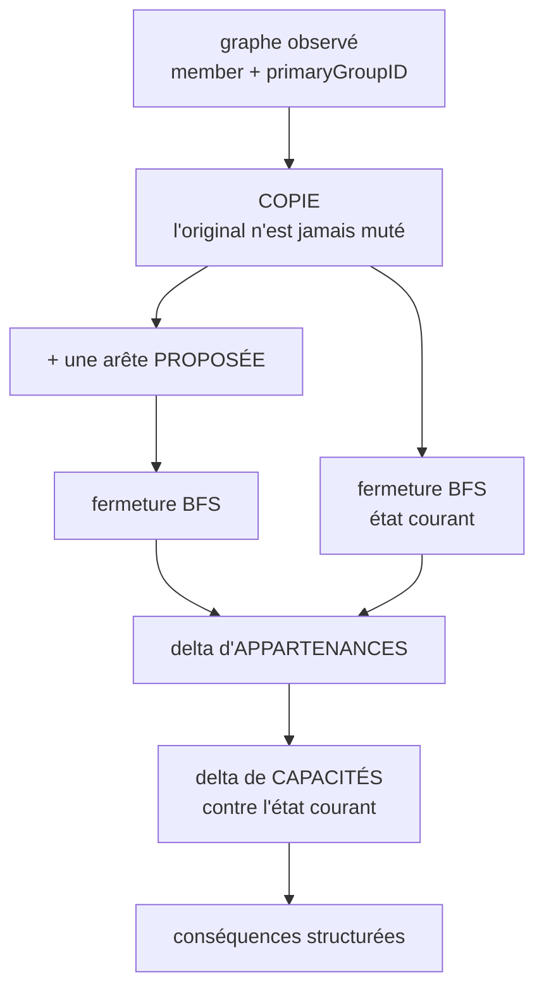

## Les sujets affectés — le piège qui sous-estime le privilège

**Le sujet affecté n'est PAS seulement le principal proposé.** Si ce principal est un **groupe**,
tout ce qui s'y trouve déjà gagne aussi la cible.

```
sujets_affectés = {P}  ∪  {X : X ⇝ P}
```

C'est **démontrable** : la nouvelle arête **sort** de P, donc seul ce qui atteint P gagne de la
portée.

**Cas réel [VALIDÉ SUR MOGADOR] :** proposer `GG_T1_Server_Admins → GG_T0_Admins` élève
`adm_t1_oussama` — **que personne n'a nommé** — jusqu'à `Admins du domaine` puis
`Administrateurs`.

## Les conséquences

| Type | Preuve utilisée |
|---|---|
| `NEW_EFFECTIVE_MEMBERSHIP` | fermeture par SID |
| `NEW_LOCAL_ADMIN_ACCESS` | `AdminLocalDe` (contrôle `LOCAL-ADMINS-MEMBERS`) |
| `NEW_GPO_MODIFICATION_ACCESS` | `PeutModifier` (descripteur de sécurité) |
| `MEMBERSHIP_CYCLE` | accessibilité inverse |
| `INSUFFICIENT_EVIDENCE` | preuve non affirmative |
| `CHANGEMENT_DIRECT_SANS_DELTA_DE_PRIVILEGE` | §27 |

`Applique` (filtrage de sécurité) est **écartée** : elle dit si une GPO *s'applique*, pas qu'on
peut la **modifier**.

## Ce qu'une preuve a le droit d'affirmer

La couverture de la **relation** ne suffit pas. Chaque conséquence en aval porte l'**état** et
l'**horodatage** de son observation :

```
applicable + fraîche   →  conséquence affirmative
applicable + périmée   →  conservée, réserve de péremption explicite
NOT_EVALUATED          →  INSUFFICIENT_EVIDENCE
NOT_APPLICABLE         →  INSUFFICIENT_EVIDENCE
```

> **Le cas réel qui a imposé la dernière ligne.** Sur ce domaine, `LOCAL-ADMINS-MEMBERS` est
> `NOT_APPLICABLE` sur DC-01, vieux de **392 heures**, et jamais marqué périmé — parce qu'un
> `N/A` ne périme pas, ce qui est juste. Mais cette ligne **porte quand même des membres**, et
> la relation les rend sous une couverture `COMPLETE`. En tirer « nouvelle administration locale
> de DC-01 » serait une affirmation appuyée sur une mesure de seize jours étiquetée complète.

## Cycles

La question est posée **directement** — *« le groupe cible atteint-il déjà le principal ? »* —
et non lue dans les cycles rendus par la fermeture, qui n'en voit qu'une partie.

`MEMBERSHIP_CYCLE` est émis **et les autres conséquences restent calculées** : un cycle rend
chaque membre effectivement membre de tous les autres, ce sont des privilèges réels.

> **MADSC n'affirme rien sur ce qu'Active Directory accepterait ou refuserait.** Il ne l'a ni
> mesuré ni prouvé, et l'imbrication circulaire existe dans de vrais annuaires.

## Le refus de connexion : annotation, jamais annulation

Si un `SeDeny*LogonRight` porte sur l'hôte concerné, MADSC l'**annote** :

> *« Un refus de connexion est observé sur cet hôte pour un des groupes gagnés. MADSC ne conclut
> ni que le privilège est annulé, ni qu'il est exploitable malgré ce garde-fou. »*

**Pourquoi ne pas supprimer la conséquence ?** L'appartenance existe ; le refus est une mesure
**séparée**, modifiable par GPO, et qui ne couvre pas tous les usages. L'effacer cacherait un
privilège réel.

## Les compteurs honnêtes — trois états **[IMPLÉMENTÉ]**

```
                          couverture COMPLETE ?
                                   │
                       ┌───────────┴───────────┐
                      NON                     OUI
                       │                       │
                       │      INSUFFICIENT_EVIDENCE dans ce domaine ?
                       │                       │
                       │              ┌────────┴────────┐
                       │             OUI               NON
                       ▼              ▼                 ▼
                  NON CONCLUANT   NON CONCLUANT     CONCLUANT
```

```
CONCLUANT                  →  EXACT             « 3 », et « 0 » est autorisé
NON CONCLUANT, n > 0       →  MINIMUM PROUVÉ    « 1 prouvé »
NON CONCLUANT, n = 0       →  NON DÉTERMINABLE  jamais « 0 »
```

**La seconde condition n'est pas cosmétique.** Sur `GG_T1_Server_Admins → GG_T0_Admins`, les
trois couvertures sont `COMPLETE` et aucun accès local n'est affirmé — mais le moteur connaît
**deux candidats sur DC-01, en Tier 0**, dont la source est `NOT_APPLICABLE`. Une règle qui ne
regarderait que la couverture écrirait « Hôtes admin nouveaux : 0 ». **Un mensonge produit par
une règle trop grossière.**

## Les deux références d'interface **[VALIDÉ SUR MOGADOR]**

```
Hibalahrouf → GG_T1_Server_Admins
  sujets affectés             1     EXACT
  appartenances nouvelles     3     EXACT
  hôtes admin nouveaux        1     EXACT
  GPO modifiables nouvelles   0     EXACT

GG_T1_Server_Admins → GG_T0_Admins
  sujets affectés             2     EXACT
  appartenances nouvelles     8     EXACT
  hôtes admin nouveaux        NON DÉTERMINABLE
  relations sujet/GPO         40    EXACT   (20 GPO uniques, 2 sujets)
```

## Réserves permanentes rendues sur chaque simulation

- angle mort `primaryGroupID` — **seulement si l'attribut n'a pas été collecté** ;
- **jeton de sécurité Windows** : une appartenance nouvellement accordée n'est pas exerçable
  immédiatement — il faut une nouvelle ouverture de session ;
- **aucun RSOP** ;
- aucune capacité déduite d'un nom ;
- ACL/délégations générales hors périmètre ;
- imbrication de groupes **locaux** non modélisée.

### Fichiers principaux

- `backend/privilege_preflight.py`, `dashboard/vues/appartenance.py`
- `dashboard/controllers/changeguard_controller.py`
- `tests/test_privilege_preflight.py`, `tests/test_appartenance_vue.py`,
  `tests/test_changeguard_appartenance.py`

---

# 26. Nouveau chemin ≠ nouvelle capacité

## Le bug réel **[trouvé en simulation contrôlée, pas en relecture]**

La première version du moteur annonçait :

```
NEW_LOCAL_ADMIN_ACCESS   adm_t1_oussama  →  PMS-01
```

pour la proposition `GG_T1_Server_Admins → GG_T0_Admins`.

**C'était faux.** `adm_t1_oussama` administrait **déjà** PMS-01 :

```
adm_t1_oussama → GG_T1_Server_Admins → DL_PMS01_LocalAdmins → PMS-01     (existant)
adm_t1_oussama → GG_T1_Server_Admins → GG_T0_Admins → Admins du domaine
                                     → PMS-01                            (nouveau CHEMIN)
```

**Seul l'itinéraire était neuf. Le privilège, non.**

## Pourquoi c'est dangereux

Un opérateur qui lit « nouvelle administration locale sur PMS-01 » pourrait refuser un
changement inoffensif — ou, pire, s'habituer à ce que l'outil exagère et cesser de le croire.

## La correction

Le delta porte désormais sur la **CAPACITÉ**, pas sur l'itinéraire :

```
capacités_déjà_détenues(sujet) = { hôtes / GPO atteints par le graphe COURANT }
conséquence émise SI et SEULEMENT SI la cible n'y figure pas
```

Résultat : la simulation est passée de **52 à 50 conséquences**, les deux faux accès ayant
disparu.

## La leçon architecturale

> **Un graphe enrichi n'améliore pas automatiquement un delta.** Ajouter des chemins augmente
> mécaniquement le nombre de chemins nouveaux ; seule une comparaison **contre l'état courant**
> dit si une capacité est nouvelle.

Et une leçon de méthode : **c'est l'inspection manuelle de simulations réelles qui l'a trouvé**,
pas la relecture du code. C'est pourquoi la validation sur données réelles est une étape à part
entière du processus.

### Fichiers principaux

- `backend/privilege_preflight.py` (`portee_courante`, `_admin_local`, `_modification_gpo`)
- `tests/test_privilege_preflight.py` (`test_un_hote_deja_administre_n_est_pas_un_acces_nouveau`)

---

# 27. `CHANGEMENT_DIRECT_SANS_DELTA_DE_PRIVILEGE`

## Le cas

```
Hibalahrouf.primaryGroupID = 513 (Utilisateurs du domaine)

PROPOSITION :  ADD_MEMBER  Hibalahrouf → Utilisateurs du domaine
```

Que se passe-t-il ?

| | |
|---|---|
| l'arête `member` serait-elle créée ? | **OUI** — elle n'existe pas |
| le privilège effectif changerait-il ? | **NON** — il est déjà détenu par le groupe primaire |

## Pourquoi `SIMULE` et pas `AUCUN_CHANGEMENT`

```
AUCUN_CHANGEMENT   réservé au cas où l'arête `member` existe DÉJÀ
                   → rien ne serait écrit du tout

SIMULE             la simulation a tourné, et a rendu un delta NUL
                   → la structure de l'annuaire changerait bel et bien
```

## Pourquoi une conséquence et non un quatrième état global

`etat` répond à *« la simulation a-t-elle tourné ? »*. Ici, oui. Un quatrième état aurait fallu
traiter dans le bandeau KPI, la vue-modèle et le rendu — pour un cas **entièrement exprimable**
là où il est.

## Le rendu

```
Utilisateurs du domaine

Arête directe proposée    NOUVELLE
Appartenance effective    DÉJÀ EXISTANTE
Capacité nouvelle         aucune

Hibalahrouf
  ↓ groupe primaire · DÉRIVÉ depuis primaryGroupID OBSERVÉ
Utilisateurs du domaine
```

## Un défaut trouvé lors de la validation réelle

Le premier rendu affichait le chemin **PROPOSÉ**, marqué `PROPOSÉ`, alors que le texte disait
« déjà détenu par le chemin ci-dessus ». **Texte et illustration se contredisaient** — le
privilège est détenu précisément **sans** la proposition. Et le saut primaire était étiqueté
`OBSERVÉ`, c'est-à-dire comme une lecture de `member`.

Corrigé : un chemin décrivant l'état existant ne porte **aucune arête proposée**, et chaque
saut porte son mécanisme.

> **Pour la soutenance.** Ce bloc est l'exemple le plus parlant du produit : MADSC distingue un
> **changement structurel réel** d'un **changement de privilège**. Aucun scanner ne fait cette
> distinction.

### Fichiers principaux

- `backend/privilege_preflight.py`, `dashboard/controllers/changeguard_controller.py`

---

# 28. Chaque page de l'application

**15 vues** dans la navigation actuelle.

## Vue d'ensemble (`?view=dashboard`)

| | |
|---|---|
| **Objectif** | l'état global en un écran |
| **Cible** | direction, responsable sécurité |
| **Données** | posture, score, agents Wazuh, alertes récentes, tendance |
| **Contrôleur** | `dashboard/controllers/overview_controller.py` |
| **KPI** | score pondéré, contrôles conformes, hôtes, agents, alertes 24 h |
| **Écrit ?** | ❌ |
| **Découverte** | bandeau « MODE DÉCOUVERTE », score « Non évalué » |
| **Limite** | le score dépend de ce qui a été collecté (§14) |

## Environnement AD (`?view=environnement`)

| | |
|---|---|
| **Objectif** | ce que MADSC a lu de l'annuaire, **avant tout jugement** |
| **Données** | `ad_model` seul — ni Wazuh, ni posture de conformité |
| **Contrôleur** | `dashboard/controllers/environnement_controller.py` |
| **Panneaux** | Découverte · Structure détectée · Couverture du modèle · Identités et appartenances · Relations directes · Chaînes effectives · Corroboration · Brouillon de site |
| **Écrit ?** | ❌ |
| **Particularité** | **seule page qui ne porte AUCUN verdict** |

Détail complet en §29.

## Conformité (`?view=compliance`)

| | |
|---|---|
| **Objectif** | matrice contrôle × hôte |
| **Données** | `latest_posture()` |
| **KPI** | taux de conformité (ou « Non évalué ») |
| **Écrit ?** | ❌ |
| **États vides** | `NOT_COLLECTED` — état d'**affichage**, absent de la base |

## Hôtes (`?view=hosts`)

| | |
|---|---|
| **Objectif** | par machine : rôle, fraîcheur, conformité |
| **Piège traité** | `WS-01` et `DESKTOP-0LKLBTR` sont **une seule machine** — la table `host_aliases` de `lab_info.json` les réconcilie |
| **Écrit ?** | ❌ |

## Baseline (`?view=baseline`)

| | |
|---|---|
| **Objectif** | ce qui a été approuvé, et quand |
| **Actions** | approbation via `POST /baseline/approve` (clé d'API) |
| **Écrit ?** | ✅ **table `baseline` uniquement** — jamais AD |

## Changements & Dérive (`?view=changes`)

| | |
|---|---|
| **Objectif** | ce qui a bougé depuis la baseline |
| **Écrit ?** | ❌ |

## Corrélation (`?view=correlation`)

| | |
|---|---|
| **Objectif** | rapprocher une dérive AD d'un événement Wazuh daté |
| **Données** | `control_results` + `ad_change_events` |
| **Écrit ?** | ❌ |
| **Limite** | l'absence de corrélation ne prouve rien : `wazuh-alerts-*` ne contient que les correspondances de règles |

## ChangeGuard (`?view=changeguard`)

| | |
|---|---|
| **Objectif** | préflight — deux onglets serveur |
| **Actions** | `POST /changeguard/preflight`, `POST /changeguard/appartenance` |
| **Écrit ?** | ❌ — **aucun bouton Appliquer / Déployer / Exécuter** |

Détail en §23 et §25.

## Alertes (`?view=alerts`)

| | |
|---|---|
| **Données** | Indexer Wazuh |
| **Limite** | « zéro alerte » est **normal** — tout le lab produit une dizaine d'alertes Sysmon par jour |

## Santé de la détection (`?view=detection`)

| | |
|---|---|
| **Objectif** | la chaîne de détection est-elle vivante ? |
| **Données** | capteurs (posture) + volumes 24 h par source (Indexer) |
| **Sources** | `security`, `sysmon`, `powershell`, `audit`, `authentication` |
| **Écrit ?** | ❌ |

## Supervision Wazuh (`?view=wazuh`)

| | |
|---|---|
| **Objectif** | l'état du SIEM lui-même |
| **Limite documentée** | `wazuh_status()` déclare l'API « disponible » sur la seule obtention d'un **jeton** — aucun appel de données n'est tenté. Le ruban peut donc annoncer « API joignable » pendant que toute lecture échoue. **Non corrigé**, et documenté comme tel |

## Règles (`?view=rules`)

| | |
|---|---|
| **Objectif** | les cinq niveaux de vérification des règles Wazuh |
| **Niveaux** | existence · activation · sévérité · **intégrité** (SHA-256) · **unicité** (`id` dupliqué) |
| **Actions** | `POST /baseline/rules/approve` |

> **Pourquoi le cinquième niveau existe.** Wazuh n'émet **aucune erreur** sur un `id` déclaré
> deux fois : la dernière définition chargée l'emporte en silence. Existence, activation,
> sévérité et intégrité portent alors **toutes** sur la règle qui l'emporte — quatre « conforme »
> pendant que la définition attendue a été supplantée.

## MITRE ATT&CK (`?view=mitre`)

| | |
|---|---|
| **Objectif** | couverture par technique, **calculée sur l'état mesuré** |
| **Limite** | dépend du catalogue Mogador (§31) |

## Mise en service (`?view=onboarding`)

Détail en §30.

## Rapports (`?view=reports`)

| | |
|---|---|
| **Sorties** | `/report/direction`, `/report/technique`, `/report/ecart` (PDF) |
| **Écrit ?** | ❌ (génère un fichier en réponse, ne persiste rien) |

## Tableau récapitulatif

| Page | But | Sources principales | Écrit ? |
|---|---|---|---|
| Vue d'ensemble | état global | posture + Wazuh | ❌ |
| Environnement AD | décrire l'annuaire | `ad_model` | ❌ |
| Conformité | matrice contrôle × hôte | posture | ❌ |
| Hôtes | par machine | posture + `lab_info` | ❌ |
| Baseline | valeurs approuvées | table `baseline` | ✅ base seule |
| Changements & Dérive | ce qui a bougé | posture + baseline | ❌ |
| Corrélation | dérive ↔ événement | posture + `ad_change_events` | ❌ |
| ChangeGuard | préflight | `ad_model` + GPO | ❌ |
| Alertes | alertes récentes | Indexer | ❌ |
| Santé de la détection | capteurs + volumes | posture + Indexer | ❌ |
| Supervision Wazuh | état du SIEM | API Wazuh | ❌ |
| Règles | 5 niveaux de vérif. | API + fichiers | ✅ base seule |
| MITRE ATT&CK | couverture technique | catalogue + états | ❌ |
| Mise en service | amorçage | `ad_model` | ❌ |
| Rapports | PDF | posture | ❌ |

> **Aucune page n'écrit dans Active Directory. Deux écrivent en base, et uniquement des
> approbations explicites.**

### Fichiers principaux

- `dashboard/shell.py` (navigation), `dashboard/controllers/` (11 contrôleurs)
- `dashboard/services/dashboard_service.py`

---

# 29. Environnement AD en détail

## Trois précautions gouvernent l'affichage

1. **Rien de compté n'est inventé** — un compteur absent s'écrit « Non collecté », jamais 0.
2. **Chaque relation affiche sa COUVERTURE** — une liste vide + couverture inconnue se lit
   « je ne sais pas ».
3. **Le tier est signalé comme DÉCLARÉ** — l'unité est observée, sa classification vient du
   fichier de site.

## Les panneaux

| Panneau | Contenu |
|---|---|
| **Découverte** | domaine, DC, ordinateurs, OU, groupes, GPO — ou « Non collecté » |
| **Structure détectée** | unités observées, tier **déclaré**, unités sans tier |
| **Couverture du modèle** | une ligne par relation : provenance, arêtes, couverture, portée/réserve |
| **Identités et appartenances** | appartenances directes, primaires, effectives + diagnostics |
| **Relations directes (OBSERVÉ)** | table des 46 arêtes, SID au-dessus, libellé en dessous |
| **Chaînes effectives (DÉRIVÉ)** | chaînes écrites, **chaque saut portant son mécanisme** |
| **Corroboration** | les cinq groupes privilégiés, états, réserve permanente |
| **Brouillon de déclaration de site** | TOML à copier et compléter (§30) |

## Les diagnostics — comptés, pas racontés

| Diagnostic | Ce que cela signifie |
|---|---|
| Principaux de forêt approuvée | **conservés** — les écarter masquerait un privilège accordé depuis une forêt approuvée |
| Principaux non résolus | DN conservés sans identité (objet supprimé ?). Les supprimer ferait disparaître une appartenance réelle |
| Cycles d'imbrication | parcours **arrêté et signalé** — le tronquer sous-estimerait l'appartenance |
| Groupes à récupération incomplète | limite `MaxValRange` — MADSC refuse d'appeler complet un graphe possiblement tronqué |

## Pourquoi ce n'est PAS BloodHound

| | BloodHound | Environnement AD |
|---|---|---|
| Forme | graphe nœuds/arêtes | **chaînes écrites** |
| Absence d'arête | indiscernable d'une preuve d'absence | **couverture affichée** |
| Provenance par saut | non | **oui** (`OBSERVÉ` / `DÉRIVÉ d'un attribut OBSERVÉ`) |
| Non-résolus | souvent masqués | **conservés avec leur raison** |
| But | trouver un chemin d'attaque | **prouver ce qui a été lu** |

> **Règle explicite du code :** *« pas de vue nœuds/arêtes, où une absence se confondrait avec
> une preuve d'absence. »*

### Fichiers principaux

- `dashboard/controllers/environnement_controller.py`
- `tests/test_environnement_identites.py`

---

# 30. Mise en service

## À quoi sert cette page

Installer MADSC sur un **nouvel** annuaire sans écrire le fichier de site de zéro.

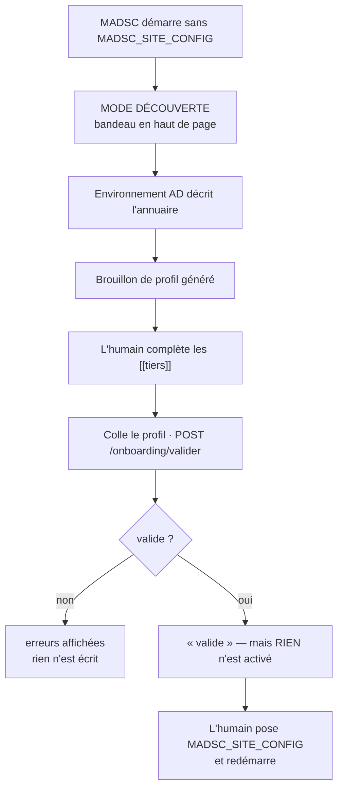

## Le brouillon n'attribue AUCUN tier

**Règle absolue.** Pas même à « Domain Controllers ».

MADSC peut **constater** qu'une machine se déclare contrôleur de domaine (rôle relayé par le
collecteur) ; il ne peut pas en déduire une **classification de sécurité**, qui reste une
décision humaine.

Le brouillon liste donc **toutes** les unités découvertes en commentaire, avec les indices
mesurés qui aident à trancher, et un squelette de tier **vide** à compléter.

> **Il n'est pas chargeable en l'état** : `[[tiers]]` y est vide, ce que `site_config` refuse —
> non pas parce que toutes les unités devraient être classées, mais parce qu'un fichier **sans
> aucun tier** ne décrit aucun modèle d'administration.

## Vérifier ≠ activer

`POST /onboarding/valider` passe le profil collé au **validateur du démarrage** puis le jette.
**Aucun fichier n'est écrit, aucune politique n'est changée.**

> **Pourquoi séparer.** Fondre les deux ferait d'un clic de vérification un **changement de
> politique de sécurité**. MADSC ne modifie pas plus sa configuration qu'il ne modifie
> l'annuaire.

Le validateur est **réutilisé**, pas réécrit : un second validateur divergerait, et c'est celui
de la page qui aurait tort.

### Fichiers principaux

- `dashboard/controllers/onboarding_controller.py`
- `backend/ad_model.py` (`profil_brouillon`), `backend/site_config.py`
- `tests/test_mode_decouverte.py`

---

# 31. Détection / Wazuh — état actuel

> **Cette section décrit le CODE ACTUEL.** Le chantier `Detection Pack / DetectionProvider`
> est **conçu mais NON IMPLÉMENTÉ** — voir §38.

## L'architecture actuelle

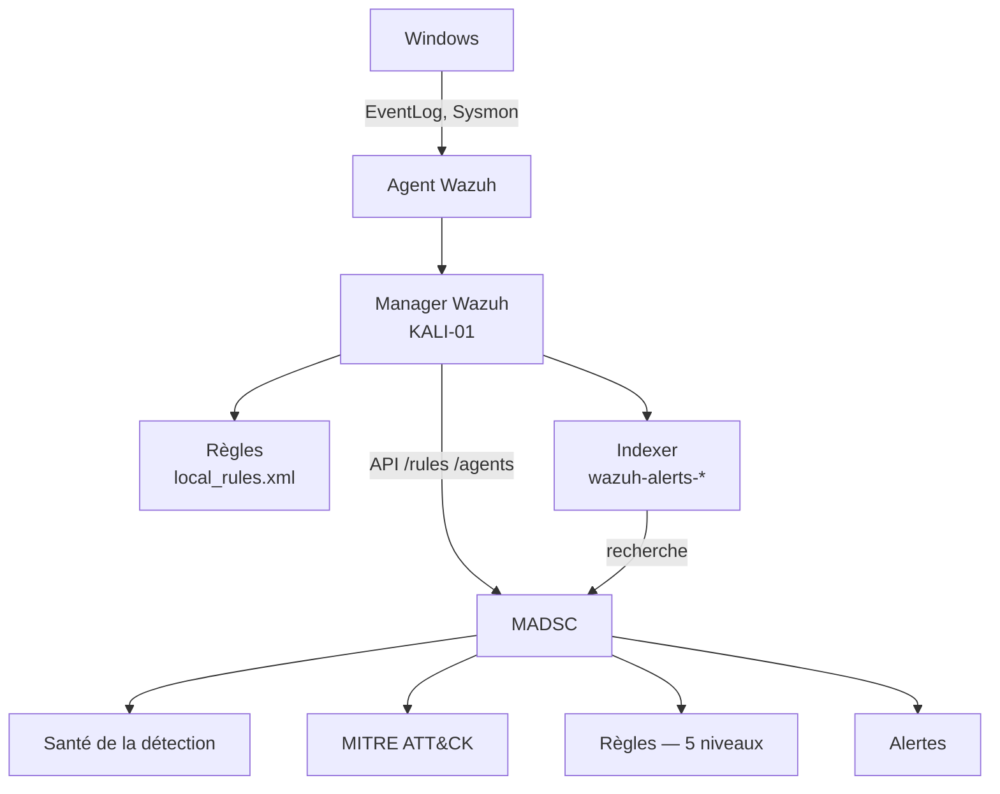

## Les deux catalogues codés en dur **[LIMITE]**

| Table | Contenu | Fichier |
|---|---|---|
| `SCENARIOS` (15 scénarios, **21 règles** déclarées) | scénario, tactique, `mitre_ids`, `rules[]`, portée, statut Phase D | `backend/detection_catalog.py` |
| `CUSTOM_RULES_CATALOG` (**25**) | par ID : nom, niveau, `mitre_ids`, tactique, scénario | `backend/wazuh.py` |
| `CONFIG_MIRRORS` (5) | règle → contrôles MADSC | `backend/coverage.py` |
| `RULE_SENSOR_REQUIREMENTS` (7) | règle → capteurs requis | `backend/coverage.py` |
| `SOUS_CATEGORIES_SURVEILLEES` | GUID d'audit → (libellé, EventID, **règles**) | `backend/changeguard.py` |

> **Les deux tables n'ont pas le même périmètre — mesuré à l'inspection.**
>
> ```
> règles déclarées par les SCENARIOS      21
> entrées de CUSTOM_RULES_CATALOG         25
>
> dans CUSTOM_RULES_CATALOG seulement     60003, 60640, 61100, 61607, 81100
>                                         → règles INTÉGRÉES de Wazuh, hors registre Mogador
> dans SCENARIOS seulement                100055
>                                         → Golden Ticket, ÉCRITE mais PAS DÉPLOYÉE
> ```
>
> Le cas `100055` est **volontaire et documenté dans le code** : tant qu'elle n'est pas chargée
> dans le manager, la couverture ATT&CK mesurée la compte comme une **lacune**. *Déclarer une
> règle ne la déploie pas, et une technique n'est couverte que par une règle réellement présente
> et active.*

> **Incohérence constatée à l'inspection.** `mitre_ids` et `scenario` existent **des deux
> côtés** — `SCENARIOS` et `CUSTOM_RULES_CATALOG` — et **divergent déjà**. La règle `100040`
> est `"Violation de Tiering"` dans `wazuh.py` et `"Violation de tiering (T1→T2)"` dans
> `detection_catalog.py` ; `100042` porte la tactique `Defense Evasion` d'un côté, `Exécution`
> de l'autre. **Personne ne fait autorité aujourd'hui.**

## Le garde-fou de portabilité **[IMPLÉMENTÉ]**

```toml
[detection]
actif = false
```

Présent dans `config/acme.toml` et `config/decouverte.toml`. Quand la détection est coupée,
MADSC **s'abstient** d'attribuer à l'annuaire des règles qu'il n'a jamais eues.

> Ce n'est **pas une dégradation, c'est le refus d'une affirmation fausse.**

`mogador.toml` n'a **aucun bloc `[detection]`** — la valeur par défaut est donc `actif = true`.

## Les cinq niveaux de vérification des règles

| Niveau | Ce qui est vérifié | État au 11 août (Wazuh joignable) |
|---|---|---|
| Existence | la règle est chargée | 20 / 20 |
| Activation | elle est `enabled` | 20 / 20 |
| Sévérité | le niveau correspond au catalogue | conforme ce jour-là |
| **Intégrité** | SHA-256 vs baseline approuvée | **19 / 20** empreintées |
| **Unicité** | `id` déclaré deux fois | **jamais mesuré avec Wazuh joignable** |

> **Pourquoi 19 et non 20.** L'empreinte ne couvre que les fichiers listés dans
> `WAZUH_RULE_FILES` (défaut `local_rules.xml`). La règle `92057` vit dans un fichier **livré
> par Wazuh** : elle est vérifiée en existence, activation et niveau, **mais son contenu n'est
> comparé à rien**. La carte l'affiche explicitement plutôt que d'annoncer une couverture
> qu'elle n'a pas.

> **Documenté historiquement, à revalider.** Les chiffres ci-dessus datent du **11 août** et
> dépendent d'un manager Wazuh joignable. Tout ce qui vient de Wazuh s'affiche « non vérifié »
> quand le manager est injoignable — comportement voulu, **mais ces chiffres ne doivent pas
> être cités en soutenance sans avoir été rafraîchis.**

## Le seuil qui rend une règle muette

Une règle de niveau **inférieur** au `log_alert_level` d'`ossec.conf` reste présente, active, au
bon niveau, d'empreinte intacte — **et ne produit jamais d'alerte**. La page Règles croise les
deux et compte les règles concernées.

## Limites de l'Indexer **[LIMITE]**

`/alerts` de l'API renvoie **404** sur cette installation : seuls des **compteurs cumulés** sont
disponibles via `/manager/stats`. Les **deltas entre deux relevés** sont la seule granularité
temporelle atteignable par cette voie. Les alertes datées viennent de l'Indexer directement.

### Fichiers principaux

- `backend/wazuh.py`, `backend/detection_catalog.py`, `backend/coverage.py`
- `dashboard/controllers/detection_controller.py`, `.../rules_controller.py`
- `detection/` (fichiers de règles conservés dans le dépôt)

---

# 32. Flux complets d'une donnée

## Flux 1 — la signature SMB

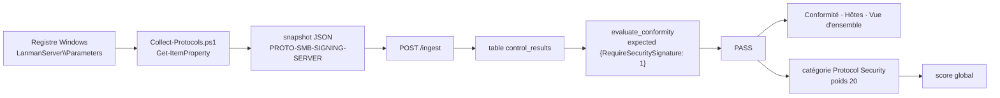

## Flux 2 — une appartenance AD

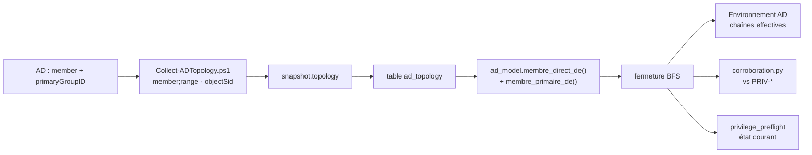

## Flux 3 — un événement Wazuh

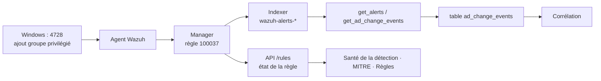

> **Ce que le flux 3 ne prouve pas.** Qu'aucune alerte n'arrive ne dit **rien** : ni que
> l'attaque n'a pas eu lieu, ni que le capteur est mort. Il faut croiser avec les niveaux 2 à 5
> du §9.

---

# 33. Sécurité de MADSC lui-même

## Ce qui est en place **[IMPLÉMENTÉ]**

| Garantie | Comment elle est tenue | Preuve |
|---|---|---|
| **Lecture seule AD** | uniquement des cmdlets `Get-*`, ADSI en lecture, `auditpol /backup`, `secedit /export` | chaque collecteur déclare ses opérations en tête ; `-Preview` sur ADTopology |
| **Le secret LAPS n'est jamais lu** | `ms-Mcs-AdmPwd` n'apparaît dans **aucun code exécutable** — seulement dans des commentaires expliquant son exclusion | inspection du code |
| **Aucune écriture en base par les moteurs** | `ad_model`, `corroboration`, `privilege_preflight` sont des projections pures | tests comparant l'empreinte de la base avant/après |
| **Écritures protégées par clé d'API** | `/ingest`, `/ingest/scan`, `/baseline/*` | `tests/test_api_key.py` recense **toutes** les routes d'écriture |
| **Console protégée par session** | tout ce qui n'est ni public ni machine | middleware de session |
| **Aucun effet des simulations sur les verdicts** | test d'import statique : aucun module de la chaîne de décision n'importe `corroboration` ni `privilege_preflight` | tests d'isolation |
| **TLS** | activé dès qu'un certificat est présent | `Start-Madsc.ps1` |
| **Secrets hors du dépôt** | `madsc.env` gitignoré ; clé lue dans l'environnement, jamais en ligne de commande | `.gitignore` |
| **Export GPO exclu du dépôt** | il porte les SID de tous les groupes, l'arborescence de tiering, les descripteurs de sécurité, le certificat EFS | `.gitignore` |

## Ce qui n'est PAS encore de niveau production **[LIMITE]**

| Manque | Impact | Contournement actuel |
|---|---|---|
| Authentification à **un seul compte**, pas de rôles | pas de séparation lecture/approbation | usage mono-opérateur |
| Pas de SSO / OIDC / MFA | intégration annuaire d'entreprise impossible | — |
| **Certificat auto-signé** | il faut l'installer sur chaque VM ; sa régénération invalide la confiance partout | `Install-MadscCertificate.ps1` |
| Pas de **piste d'audit** des actions console | on ne sait pas qui a approuvé une baseline, ni quand exactement | horodatage d'approbation seulement |
| **SQLite** | mono-écrivain, pas de sauvegarde intégrée | fichier unique à sauvegarder |
| Pas de rotation de la clé d'API | une clé compromise reste valable | changement manuel + redémarrage |
| Pas de limitation de débit sur `/login` | *À confirmer — le code inspecté mentionne un anti-bourrage sans que j'aie vérifié son fonctionnement en détail* | — |

### Fichiers principaux

- `backend/auth.py`, `backend/main.py` (middleware), `.gitignore`
- `tools/New-MadscCertificate.ps1`, `tools/Install-MadscCertificate.ps1`
- `tests/test_api_key.py`, `tests/test_login.py`

---

# 34. Tests

## Le chiffre **[VÉRIFIÉ]**

```
993 tests, tous verts
```

## Les familles

| Famille | Rôle | Exemple |
|---|---|---|
| **unitaires** | un module, une règle | `test_evaluate.py` |
| **fixtures** | jeux d'essai reproductibles | `tests/fixtures/gpo_report_all.xml` |
| **empreintes (goldens)** | le contenu **affiché** de chaque vue | `tests/golden/*.txt` (15) |
| **tests de source** | interdisent un motif dans le code | « aucun appel à `.membre_effectif_de(` » |
| **tests d'isolation** | prouvent qu'un module n'en influence pas un autre | « aucun module de verdict n'importe `corroboration` » |
| **anti-régression** | épinglent un défaut corrigé | §35 |
| **tests sur données réelles** | vérifient contre le domaine | `tools/verifier_corroboration.py` |

## Le rôle des empreintes

Chaque vue est rendue, dépouillée de sa présentation, et comparée à un texte validé. **Repeindre
ne doit pas faire bouger l'empreinte** — sinon le filet serait inutile.

> ### Pourquoi on ne régénère JAMAIS une empreinte pour masquer une différence
>
> Une empreinte régénérée sans être relue transforme un **défaut** en **nouvelle référence**.
> Le message d'échec le dit explicitement : *« Si c'est voulu, régénérer l'empreinte et RELIRE
> le diff avant de valider. »*
>
> Dans ce projet, chaque ré-approbation a été précédée d'une lecture du diff **complet**, et
> suivie d'une vérification par **hachage** que seules les empreintes attendues avaient bougé.

## Le piège des dates absolues

Des tests d'empreinte peuvent passer le jour de leur écriture puis échouer le lendemain, sans
qu'aucun code n'ait bougé : les vues qui raisonnent « aujourd'hui » basculent au changement de
jour. **Toutes** les dates des jeux d'essai sont donc relatives à l'instant du test.

## Un clone froid ne suffit pas

Sur un dépôt fraîchement cloné, **7 tests échouent** : `data/madsc.db` est ignoré et ils
supposent une base initialisée. `db.init_db()` d'abord — ce que fait déjà `Start-Madsc.ps1`.
**9 autres se sautent explicitement** (`madsc-all-gpos.xml` non versionné, avec sa raison à
l'écran) — c'est voulu.

### Fichiers principaux

- `tests/` (**46 fichiers**, 993 tests), `tests/conftest.py`, `tests/golden/` (15 empreintes)
- `tests/test_render_snapshot.py`

---

# 35. Bugs réellement trouvés par les tests

> **Section conçue pour la soutenance.** Chacun de ces défauts a été trouvé par le processus,
> pas par chance.

## 1. « 0 sous-catégorie auditée » au lieu de « je n'ai rien pu mesurer »

| | |
|---|---|
| **Bug** | une lecture échouée émettait quand même un contrôle, avec `0` |
| **Risque** | `0` ressemble à une **catastrophe de configuration** ; la réalité était une panne de lecture |
| **Pourquoi dangereux** | les deux appellent des actions **opposées** |
| **Correction** | règle n°2 : si une lecture échoue, **n'émettre aucun contrôle** et dire pourquoi |
| **Leçon** | *l'absence de mesure n'est pas une mesure nulle* |

## 2. La jauge « 0 % » en rouge du rapport direction

| | |
|---|---|
| **Bug** | trois calculs du taux de conformité, **un seul honnête** |
| **Risque** | le rapport qui **sort du bâtiment** portait la version fausse |
| **Correction** | `conformity_rate()` unique dans `backend/`, atteignable par la console **et** le PDF |
| **Leçon** | *un calcul dupliqué finit par diverger, et c'est la copie la moins relue qui a tort* |

## 3. `_worst_hosts` choisissait un compartiment vide

| | |
|---|---|
| **Bug** | l'agrégat prenait le maximum d'une liste vide |
| **Risque** | « Non disponible » pour un hôte parfaitement connu |
| **Correction** | filtrer les listes vides avant de prendre un maximum |

## 4. Deux instantanés différents comparés entre eux

| | |
|---|---|
| **Bug** | `corroborer(modele=…)` sans posture **relisait la base** — le graphe d'un instantané, les relevés `PRIV-*` d'un autre |
| **Risque** | l'écart temporel affiché n'était celui d'**aucune campagne réelle** ; la porte de contemporanéité mesurait le hasard des deux requêtes |
| **Correction** | `ModeleAD` expose sa posture ; la corroboration la reprend |
| **Leçon** | *pour une fonction dont le sujet EST la contemporanéité, sourcer les deux moitiés séparément est le défaut à ne pas laisser passer* |

## 5. La porte de couverture lisait la mauvaise relation

| | |
|---|---|
| **Bug** | la corroboration testait la couverture des arêtes **directes** |
| **Risque** | un **cycle** ne dégrade que la couverture **effective** — celle que la comparaison consomme. La porte laissait passer le cas où la population effective est **sous-estimée** |
| **Correction** | la porte lit la fermeture effective |
| **Leçon** | *vérifier la couverture de la relation qu'on CONSOMME, pas d'une relation voisine* |

## 6. Nouveau chemin pris pour une nouvelle capacité

Voir §26 en entier. **Trouvé en inspectant manuellement des simulations réelles**, pas en
relisant le code.

## 7. `AUCUN_CHANGEMENT` déclenché par un groupe primaire

| | |
|---|---|
| **Bug** | l'état testait l'arête sur le graphe **enrichi** |
| **Risque** | proposer d'ajouter un compte à son propre groupe primaire répondait « rien ne change » — alors que l'annuaire **aurait bel et bien été modifié** |
| **Correction** | le test porte sur les **seules** arêtes `member` |
| **Leçon** | *« l'attribut `member` changerait-il ? » et « le sujet a-t-il déjà ce privilège ? » sont deux questions différentes* |

## 8. Le chemin affiché contredisait le texte

| | |
|---|---|
| **Bug** | la conséquence disait « déjà détenu par le chemin ci-dessus » **en affichant la proposition** |
| **Risque** | texte et illustration se contredisaient ; un saut primaire était étiqueté `OBSERVÉ`, donc comme une lecture de `member` |
| **Correction** | un chemin décrivant l'état existant ne porte **aucune** arête proposée ; chaque saut porte son mécanisme |

## 9. Une route POST sans garde déclarée

| | |
|---|---|
| **Bug** | `/changeguard/appartenance` n'était ni gardée par clé, ni **déclarée** comme tolérée |
| **Correction** | ajoutée à la liste tolérée **avec sa raison**, et accompagnée d'un test neuf vérifiant la garde de **session** |
| **Leçon** | *tolérer l'absence de clé n'est pas tolérer l'absence de garde* |

## 10. Le champ qui n'informait plus

| | |
|---|---|
| **Bug** | « niveau de confiance » valait « Non disponible » **pour tout** |
| **Risque** | il **apprenait au lecteur à sauter les champs**, noyant les vrais « Non disponible » du même tiroir |
| **Correction** | retiré de l'écran — pas rempli |
| **Leçon** | *un champ jamais alimenté est pire qu'un champ absent* |

## 11. Une empreinte détruite par un `git checkout`

| | |
|---|---|
| **Bug** | `git checkout -- tests/golden/` sur un dépôt dont HEAD était **antérieur** au travail en cours |
| **Risque** | douze empreintes à jour **non commitées** détruites ; un `git checkout` sur un fichier source aurait été **irréversible** |
| **Correction** | régénération (déterministe) puis versionnement complet de l'état |
| **Leçon** | *un fichier non suivi ne se récupère pas — vérifier ce qui est commité AVANT toute commande destructive* |

## 12. Deux fixtures fausses, et le code avait raison

Deux tests attendaient `0 GPO modifiable` **sans rapport de stratégie collecté**. Sans GPO lue,
la couverture est `INCONNUE`, et `NON DÉTERMINABLE` est la **bonne** réponse.

> **Leçon.** *Quand un test échoue, la première hypothèse n'est pas que le code a tort.*

---

# 36. Générique vs spécifique à Mogador

| Élément | Générique | Site-specific | Provider-specific | Futur |
|---|---|---|---|---|
| Modèle AD (entités, relations) | ✅ | | | |
| Provenance / couverture | ✅ | | | |
| Identity Graph, BFS, cycles | ✅ | | | |
| `primaryGroupID` | ✅ | | | |
| Corroboration (mécanique) | ✅ | | | |
| Privilege Preflight | ✅ | | | |
| Tiers / zones | | ✅ `config/*.toml` | | |
| Convention `DL_` | | ✅ `config/*.toml` | | |
| Rapprochement ADMX | | ✅ `config/*.toml` | | |
| Noms d'unités, libellés | | ✅ | | |
| **`CATALOG` (41 contrôles)** | ⚠️ **mélangé** | ⚠️ **mélangé** | | **§38** |
| **`SCENARIOS` (15)** | | ❌ **codé en dur** | | **§38** |
| **IDs de règles `1000xx`** | | | ❌ **codé en dur** | **§38** |
| **`CUSTOM_RULES_CATALOG`** | | | ❌ **codé en dur** | **§38** |
| GUID de sous-catégories d'audit | ✅ (Microsoft) | | | |
| EventID Windows | ✅ | | | |
| Filtres Elasticsearch | | | ❌ `wazuh.py` | |
| `SENSOR-WAZUH-AGENT` (le **nom**) | | | ⚠️ nom du fournisseur | **§38** |
| Mappings MITRE | | ❌ dans le catalogue | | **§38** |

> **Honnêteté requise.** MADSC est **portable au niveau du modèle AD** — prouvé par
> `config/acme.toml` et `tests/test_portabilite_acme.py`. Il **ne l'est pas encore** au niveau
> de la détection ni du catalogue de contrôles.

---

# 37. Limites actuelles

## 1. Aucun RSOP **[LIMITE structurelle]**

| | |
|---|---|
| **Ce qui manque** | l'ordre des liens, l'héritage bloqué, les filtres WMI, le bouclage |
| **Pourquoi** | un vainqueur calculé de travers serait **plausible et faux** |
| **Impact** | ChangeGuard ne dit jamais quelle GPO l'emporte |
| **Contournement** | tout verdict porte le rappel de vérifier en RSOP |
| **Futur** | non prévu — le refus est **délibéré** |

## 2. Aucune application de changement **[choix de conception]**

MADSC n'écrit jamais. C'est ce qui le rend déployable. **Ce n'est pas une limite à corriger.**

## 3. ACL et délégations générales non modélisées **[LIMITE]**

`GenericAll`, `WriteDacl`, DCSync par ACL, RBCD ne sont pas des relations du graphe.
`Collect-Delegation` mesure certains cas (`DELEG-UNCONSTRAINED`, `KRB-USER-SPN`) mais ne les
expose pas en relations indexées par SID.

**Impact :** un chemin d'élévation par ACL est **invisible** au Privilege Preflight.

## 4. Aucune capacité LAPS déduite **[choix]**

`DL_LAPS_T1_Operators` apparaît comme appartenance, jamais comme droit de lecture. Il faudrait
lire l'**ACL** de `ms-Mcs-AdmPwd` — non collecté. *(Lire l'ACL n'est pas lire le secret ; la
règle n°6 resterait tenue.)*

## 5. Imbrication de groupes **locaux** non modélisée **[LIMITE]**

`LOCAL-ADMINS-MEMBERS` donne les membres du groupe Administrateurs local. Si l'un d'eux est un
**groupe local** contenant d'autres comptes, c'est opaque.

## 6. Un seul domaine de validation réel **[LIMITE]**

La portabilité est prouvée en « couche 1 » (aucun Python propre à Acme). La **couche 2** — un
second annuaire **réel** — n'a pas été faite. Multi-domaine et forêt ne sont pas traités.

## 7. Détection couplée à Wazuh et à Mogador **[LIMITE]**

Voir §31 et §36. C'est le chantier n°1 de la feuille de route.

## 8. `CATALOG` mélange universel et politique de site **[LIMITE]**

Certains contrôles sont universels (`PROTO-SMBv1-DISABLED`), d'autres reflètent une politique
d'organisation. Tant que ce n'est pas séparé, **le score reste non évaluable hors du domaine
d'origine** — et c'est volontaire.

## 9. Infrastructure **[LIMITE]**

SQLite, compte unique, certificat auto-signé, pas de piste d'audit, pas de rotation de clé.
Voir §33.

## 10. `wazuh_status()` déclare l'API « disponible » sur un simple jeton **[LIMITE connue]**

Aucun appel de données n'est tenté. Le ruban peut annoncer « API joignable » pendant que toute
lecture échoue. **Non corrigé** : changer ce que cette valeur affirme touche toutes les vues.

## 11. Le bilan de campagne peut mentir **[LIMITE connue]**

`Executes : 11 / 11` s'affiche même quand tous les envois ont échoué. Voir §7.

---

# 38. Travaux futurs

> **Tout ce qui suit est [FUTUR].** Rien n'est implémenté.

## Detection Pack / DetectionProvider V1

| | |
|---|---|
| **Problème actuel** | 15 scénarios, 20 IDs de règles et les mappings MITRE sont **codés en dur** dans `backend/` |
| **Pourquoi important** | MADSC prend la connaissance Wazuh de Mogador pour une **vérité universelle**. Sur un autre annuaire, il lui attribuerait des règles qu'il n'a jamais eues |
| **Architecture visée** | pack TOML (scénarios, détecteurs logiques, télémétrie, liaisons fournisseur) + interface `DetectionProvider` ; `WazuhDetectionProvider` seul en V1 |
| **Difficulté** | moyenne — extraction, pas réécriture ; ~10 consommateurs |
| **Dépendances** | aucune nouvelle (`tomllib` déjà utilisé) |
| **Valeur** | portabilité réelle de la détection ; ouvre Sentinel/Elastic/Splunk plus tard |
| **Point délicat identifié** | les deux catalogues **divergent déjà** (§31) — l'extraction force à trancher |

## Séparation `CATALOG` universel / politique de site

| | |
|---|---|
| **Problème** | un seul catalogue mélange attentes universelles et politique d'organisation |
| **Pourquoi** | c'est ce qui rend le **score** non évaluable hors du domaine d'origine |
| **Difficulté** | élevée — touche baseline, score, conformité |
| **Dépendances** | à faire **après** Detection Pack |

## Portabilité couche 2 — un second annuaire réel

| | |
|---|---|
| **Problème** | la portabilité est prouvée en code, pas en exploitation |
| **Difficulté** | faible techniquement, coûteuse en infrastructure (deux VM) |
| **Valeur** | la seule preuve qui convaincra un tiers |

## Graphe de délégations et d'ACL

| | |
|---|---|
| **Problème** | les chemins d'élévation par ACL sont invisibles |
| **Difficulté** | élevée — volumétrie, sémantique des droits étendus |
| **Valeur** | rapproche MADSC de ce qu'un attaquant voit réellement |

## Multi-domaine / forêt, et graphe des approbations

Les FSP sont **conservés** aujourd'hui, mais leur autre côté n'est pas modélisé.

## Autres chantiers

| Chantier | Problème | Valeur |
|---|---|---|
| **PostgreSQL** | SQLite mono-écrivain | parc réel, concurrence |
| **RBAC** | compte unique | séparer lecture et approbation |
| **SSO / OIDC** | pas d'intégration annuaire | déploiement d'entreprise |
| **Piste d'audit** | on ne sait pas qui a approuvé quoi | exigence de conformité |
| **Installateur / mises à jour** | déploiement manuel | adoption |
| **Enrôlement des collecteurs** | copie manuelle, pièges TLS | fiabilité (§7) |
| **Cycle de vie TLS** | certificat auto-signé, régénération invalidante | exploitation |
| **Gestion des secrets** | `.env` en clair | conformité |
| **Multi-tenant** | mono-site | offre de service |
| **Bilan de campagne honnête** | `11/11` trompeur | §7 |
| **Preflight : autres changements** | `ADD_MEMBER` seul | retrait, ACL, `primaryGroupID` |
| **Conseiller de déploiement pour l'identité** | n'existe que pour les GPO | §24 |

## Ordre recommandé

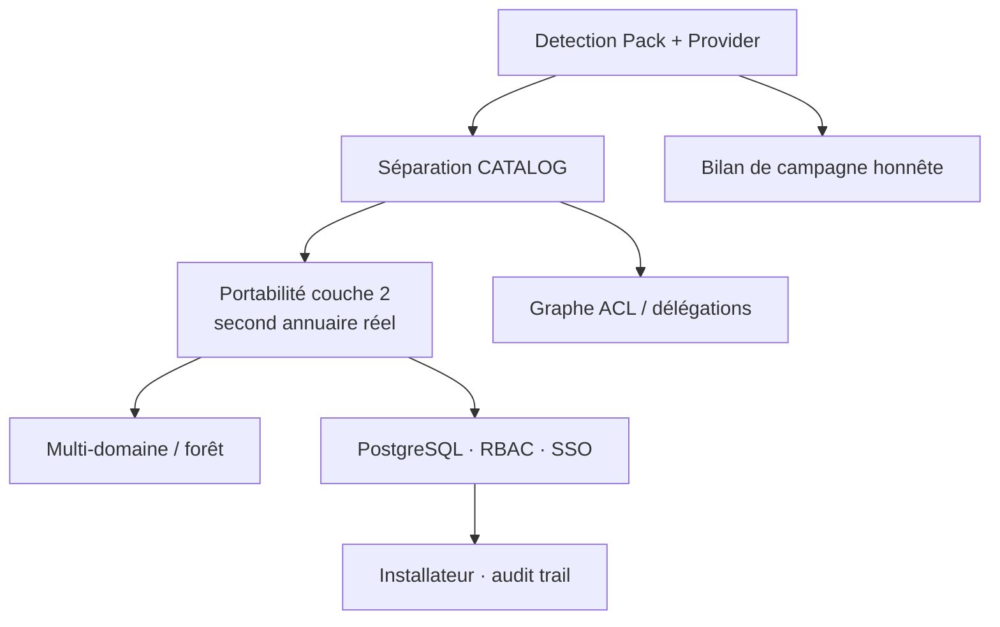

---

# 39. Décisions architecturales et justification

| Décision | Pourquoi | Ce qu'on a refusé |
|---|---|---|
| **TOML** pour la configuration | `tomllib` est dans la **bibliothèque standard** depuis Python 3.11 | **PyYAML** — une dépendance de plus, et une syntaxe où l'indentation change le sens |
| **SQLite** | zéro administration, fichier unique, suffisant pour trois hôtes | PostgreSQL — reporté à la volumétrie qui le justifiera |
| **Le SID fait foi** | le domaine est en français, des groupes **ont été renommés** | comparaison par nom |
| **Parcours en largeur** | `profondeur` = distance minimale ; le chemin affiché est le plus court. Neutralité **mesurée** avant refactor (0 écart sur 56) | pile (DFS) — surévaluait les profondeurs ≥ 2 |
| **Pas de visualisation nœuds/arêtes** | une arête absente y devient indiscernable d'une preuve d'absence | l'esthétique BloodHound |
| **Lecture seule stricte** | rend l'outil déployable sans négociation ; un outil d'audit qui écrit doit être audité | tout `Set-*` / `Add-*` |
| **Aucun bouton Appliquer** | appliquer, c'est écrire — et écrire change la nature de l'outil | l'automatisation |
| **`(arêtes, couverture)` partout** | un graphe **cache** une arête manquante, et son absence se lit comme une affirmation | une simple liste |
| **Mode découverte** | un repli silencieux vers le mauvais référentiel est le défaut que MADSC refuse ailleurs | le repli implicite sur Mogador |
| **Propositions en mémoire** | rien à retrouver, rien à confondre avec un changement réel | la persistance des propositions |
| **Deux API de fermeture explicites** | un drapeau booléen se trompe **en silence** ; six sites d'appel connus → mieux vaut qu'un appel oublié **lève** | `include_primary=True/False` |
| **Une quatrième provenance** | confondre reconstruction et lecture ferait passer un calcul pour une preuve | réutiliser `OBSERVÉ` |
| **Pas de Sentinel/Splunk maintenant** | prouver l'abstraction sur **un** fournisseur d'abord ; leur existence future informe le contrat | une abstraction spéculative |
| **`ADD_MEMBER` seul en V1** | un simulateur auquel on fait confiance vaut mieux qu'un simulateur général dont on doute | la généralité prématurée |
| **Corroboration sans effet sur les verdicts** | c'est une **métadonnée de qualité de preuve**, pas un contrôle | l'intégration au score |

---

# 40. Présenter MADSC à un encadrant

## Pitch 30 secondes

> « MADSC est une console d'assurance Active Directory **100 % en lecture seule**. Elle vérifie
> qu'un annuaire durci l'est **toujours**, conserve la preuve datée de chaque mesure, détecte
> les dérives — et permet de **simuler un changement avant de l'appliquer**. Sa particularité :
> elle dit toujours **ce qu'elle ne sait pas**, au lieu d'afficher un zéro rassurant. »

## Pitch 2 minutes

Ajoutez :

- les **quatre questions** (§1) ;
- la distinction **absence de preuve / preuve d'absence** ;
- un exemple : *« `Sysmon est Running` ne veut pas dire que toutes les attaques seront
  détectées — MADSC sépare six niveaux entre le service et l'alerte »* ;
- ChangeGuard : *« on peut demander : que produirait l'ajout de cet utilisateur à ce groupe ?
  MADSC répond en montrant les chemins, sans rien modifier. »*

## Explication 5 minutes

1. **Le problème** — un scanner photographie ; personne ne sait si l'état tient encore
2. **La collecte** — 13 collecteurs PowerShell, lecture seule, snapshots horodatés
3. **L'évaluation** — 41 contrôles, attente fixe **et** baseline, score pondéré qui **s'abstient**
   sous 50 % de couverture
4. **Le graphe d'identités** — indexé par SID, complétude **prouvée** (`MaxValRange`), cycles
   signalés, `primaryGroupID` inclus
5. **La corroboration** — deux mécanismes indépendants confrontés ; 5/5 concordants, Δ 3 s
6. **ChangeGuard** — préflight GPO et appartenance, sans application
7. **L'honnêteté** — `INCONNU ≠ 0`, provenance, couverture

## Démonstration 10–15 minutes

| # | Écran | À dire |
|---|---|---|
| 1 | **Vue d'ensemble** | « voici l'état, et voici sa **fraîcheur** » |
| 2 | **Conformité** | montrer un `NOT_EVALUATED` : *« il ne dit pas non conforme, il dit je n'ai pas mesuré »* |
| 3 | **Environnement AD** | la colonne **Couverture**. *« ce n'est pas BloodHound : chaque relation dit jusqu'où elle sait »* |
| 4 | **Chaînes effectives** | `DC-01$ → primaryGroupID → Contrôleurs de domaine → member → …`. *« ce chemin est invisible sans la v1.3 »* |
| 5 | **Corroboration** | 5/5, puis lire la réserve : *« concordant ne veut pas dire complet »* |
| 6 | **ChangeGuard GPO** | le conflit SMB. *« conforme par **préséance**, pas par accord — un scanner aurait dit conforme »* |
| 7 | **ChangeGuard Appartenance** | `GG_T1_Server_Admins → GG_T0_Admins` → *« deux sujets affectés, dont un que personne n'a nommé »* |
| 8 | **Le même écran** | montrer `NON DÉTERMINABLE` sur les hôtes admin : *« il refuse d'écrire 0 »* |
| 9 | **Preuve de non-écriture** | aucun bouton Appliquer ; montrer `-Preview` d'un collecteur ; citer le test d'isolation |

> **Le moment fort** : l'écran 8. Un outil qui refuse d'afficher un chiffre qu'il ne peut pas
> prouver est plus crédible qu'un outil qui affiche toujours quelque chose.

---

# 41. Questions probables des encadrants

**1. Pourquoi pas BloodHound ?**
BloodHound est offensif et dessine un graphe. Un dessin **cache** ce qu'il n'a pas lu : une arête
absente y est indiscernable d'une preuve d'absence. MADSC rend des chaînes écrites, chacune avec
sa provenance, et **chaque relation porte sa couverture**.

**2. Pourquoi pas PingCastle ?**
PingCastle a servi — il a fait passer le domaine de 100 à 25. Mais il photographie. MADSC
**conserve la preuve datée**, détecte la dérive, et **simule** un changement.

**3. Qu'est-ce que MADSC fait de vraiment différent ?**
Trois choses : il dit **quand il ne sait pas**, il **corrobore** ses preuves par deux mécanismes
indépendants, et il répond à *« ce changement serait-il sûr ici ? »*.

**4. Pourquoi SQLite ?**
Zéro administration, fichier unique, suffisant pour trois hôtes. PostgreSQL viendra quand la
volumétrie le justifiera, pas avant.

**5. Pourquoi Python/FastAPI ?**
Écosystème AD/sécurité mature, `tomllib` en standard, FastAPI léger et testable. Les collecteurs
sont en **PowerShell** parce qu'ils tournent sur Windows et n'ont besoin d'aucun module tiers.

**6. Comment prouvez-vous que c'est lecture seule ?**
Quatre façons : aucun `Set-*`/`New-AD*`/`Remove-*` dans les collecteurs ; chaque collecteur
**déclare ses opérations** avant de les lancer ; `-Preview` n'écrit ni n'envoie rien ; des tests
comparent l'empreinte de la base avant/après chaque simulation.

**7. Que se passe-t-il si un collecteur échoue ?**
Il **n'émet aucun contrôle** et affiche pourquoi. Le contrôle passe à `NOT_EVALUATED`, la
couverture chute, et le score peut devenir « Non évalué ». Jamais un `0`.

**8. Que veut dire `COMPLETE` ?**
Que la source couvre tout le périmètre — donc qu'**une absence est une absence**. C'est la seule
couverture qui autorise à conclure d'un vide.

**9. Pourquoi le SID ?**
Un groupe peut être renommé ; son SID non. Le domaine est en français et des groupes **ont déjà
été renommés** : comparer par nom aurait produit des faux négatifs silencieux.

**10. Pourquoi `primaryGroupID` était-il important ?**
Parce que cette appartenance n'est **ni dans `member`, ni dans `memberOf`**. Les deux sources de
MADSC étaient aveugles de la même façon — leur accord ne prouvait donc rien sur ce point. Et le
préflight décrivait comme **nouvelle** une capacité déjà détenue.

**11. Comment savez-vous que ChangeGuard ne modifie rien ?**
La proposition vit en mémoire le temps d'une réponse HTTP. Aucun appel PowerShell, aucune
écriture en base (test d'empreinte), et aucun module de la chaîne de décision n'importe le
préflight (test statique).

**12. Peut-on utiliser MADSC dans une autre entreprise ?**
**Partiellement.** Le modèle AD est portable — prouvé par `config/acme.toml` sans une ligne de
Python propre à Acme. La **détection** et le **catalogue de contrôles** ne le sont pas encore.
C'est le chantier n°1.

**13. Est-ce compatible Entra ID / AD cloud ?**
**Non.** MADSC lit LDAP/ADSI et le registre Windows. *À confirmer — rien dans le code inspecté
ne traite Entra ID.*

**14. Pourquoi Wazuh ?**
C'est le SIEM déployé en phase 2 du PFA. Le couplage est **assumé et documenté comme une
limite** ; l'abstraction `DetectionProvider` est conçue pour le lever.

**15. Peut-on remplacer Wazuh ?**
Pas aujourd'hui. La conception `DetectionProvider` existe et sépare connaissance, liaison
fournisseur et preuve d'exécution — mais **elle n'est pas implémentée**.

**16. Quelle est la valeur commerciale ?**
Un audit AD coûte cher et vieillit vite. MADSC transforme un audit ponctuel en **assurance
continue**, avec la preuve datée, et ajoute un **préflight** qu'aucun scanner n'offre.

**17. Quelles sont vos limites ?**
Aucun RSOP, ACL non modélisées, un seul domaine réel, détection couplée à Wazuh, SQLite, compte
unique. §37 les détaille toutes.

**18. Pourquoi aucun bouton Appliquer ?**
Parce qu'appliquer, c'est écrire — et un outil d'audit qui écrit doit lui-même être audité. Le
refus rend MADSC déployable sur une production sans négociation.

**19. Comment évitez-vous les faux positifs ?**
Trois mécanismes : la **couverture** (ne rien conclure d'un vide non prouvé), le **delta de
capacité** (un chemin nouveau n'est pas un privilège nouveau), et le **périmètre comparable**
(ne pas transformer une asymétrie de mécanismes en divergence).

**20. À quoi sert la corroboration ?**
À poser une question qu'une source unique ne permet pas : *deux mécanismes indépendants
décrivent-ils la même population ?* C'est une **assurance de qualité de la preuve**, sans effet
sur les verdicts.

**21. Baseline ou `expected` ?**
`expected` = « cette valeur est bonne **partout** » (SMB signing = 1). Baseline = « cette valeur
a été approuvée **ici** » (les membres de Domain Admins). Les deux coexistent, et chaque thème
en a idéalement un de chaque.

**22. Détection ou prévention ?**
MADSC ne fait **ni l'une ni l'autre** : il ne bloque rien et ne détecte aucune attaque. Il vérifie
que les **moyens** de détection sont en place et vivants.

**23. Que mesure réellement le score ?**
La part des contrôles **mesurés** qui sont conformes, pondérée par catégorie. Pas la sécurité
absolue, pas ce qui est hors catalogue, pas la qualité de la détection réelle.

**24. Pourquoi un score peut-il disparaître ?**
Sous 50 % de couverture, un chiffre ne décrirait plus la posture mais **le hasard de ce qui
restait mesurable**. MADSC affiche alors « Non évalué » **plus le dernier score probant daté**.

**25. Que se passe-t-il si l'horloge d'une VM dérive ?**
`DC-01` a réellement eu **3,91 jours** de retard après une restauration d'instantané. MADSC
compare `collected_at` (horloge VM) et `ingested_at` (horloge MADSC), et la corroboration
**refuse de comparer** deux relevés venant d'hôtes différents.

**26. Combien de tests, et que prouvent-ils ?**
993. Ils couvrent l'unitaire, les empreintes d'affichage, les **tests de source** (interdire un
motif), l'**isolation** (aucun module de verdict n'importe les simulations) et la non-régression.

**27. Que se passe-t-il si Wazuh est injoignable ?**
Tout ce qui en vient s'affiche « non vérifié » — **jamais « conforme » ni « manquant »**. Une
panne réseau ne doit se lire ni comme un résultat propre, ni comme une compromission.

**28. Pourquoi ne pas notifier la valeur observée par e-mail ?**
Une dérive sur `PRIV-DOMAIN-ADMINS` expédierait la **liste nominative des comptes à privilèges**
vers une boîte aux lettres non défendue — on ferait de la messagerie un chemin d'attaque plus
court que le domaine. Le message porte le constat, jamais la valeur.

---

# 42. Glossaire

| Terme | Définition simple |
|---|---|
| **AD** | Active Directory — l'annuaire qui gère comptes, machines et droits d'un domaine Windows |
| **OU** | Unité d'organisation — un dossier de l'annuaire, sur lequel on attache des stratégies |
| **GPO** | Stratégie de groupe — un paquet de réglages appliqué aux machines/utilisateurs d'une OU |
| **SID** | Identifiant de sécurité — l'identité **immuable** d'un objet. Ne change pas au renommage |
| **RID** | La dernière partie d'un SID. `512` = Admins du domaine, `513` = Utilisateurs du domaine |
| **AGDLP** | Compte → Groupe Global → Groupe de Domaine Local → Permission. La chaîne d'attribution recommandée |
| **Tier 0/1/2** | Zones d'administration. T0 = contrôleurs de domaine, T1 = serveurs, T2 = postes |
| **LDAP** | Le protocole d'interrogation de l'annuaire (port 389) |
| **ADSI** | Interface Windows d'accès LDAP. Ne dépend pas d'ADWS, donc plus robuste que `Get-AD*` |
| **ADWS** | Service web AD (port 9389) dont dépend le module PowerShell ActiveDirectory |
| **`member`** | Attribut d'un **groupe** listant ses membres directs |
| **`memberOf`** | Attribut d'un **compte** listant ses groupes |
| **`primaryGroupID`** | RID du groupe **primaire** d'un compte. **Absent de `member` et de `memberOf`** |
| **MaxValRange** | Limite LDAP (1500) au-delà de laquelle `member` revient **tronqué sans erreur** |
| **IN_CHAIN** | Règle LDAP `1.2.840.113556.1.4.1941` qui rend les membres **récursifs** |
| **FSP** | *Foreign Security Principal* — représentant local d'un principal d'une forêt approuvée |
| **RSOP** | *Resultant Set of Policy* — ce qui s'applique réellement après arbitrage. **Non calculé** |
| **SACL** | Liste d'audit d'un objet. Sans elle, pas d'événement 4662/5136 |
| **Sysmon** | Agent Microsoft journalisant processus et lignes de commande |
| **Wazuh** | Le SIEM open source utilisé — agents, manager, Indexer |
| **Indexer** | Le moteur de recherche de Wazuh, où vivent les alertes datées |
| **MITRE ATT&CK** | Référentiel des techniques d'attaque (`T1098`, `T1558.003`…) |
| **baseline** | Valeur **approuvée par un humain**, référence de la dérive |
| **dérive (drift)** | Écart entre la valeur mesurée et la baseline approuvée |
| **couverture** | Jusqu'où une source **sait** — `COMPLETE` / `PARTIELLE` / `INCONNUE` |
| **provenance** | D'où vient un fait — `OBSERVÉ` / `DÉRIVÉ` / `DÉCLARÉ` / `DÉRIVÉ d'un attribut OBSERVÉ` |
| **corroboration** | Confronter deux mécanismes indépendants sur le même fait |
| **rayon d'impact** | Ensemble des machines qu'un changement toucherait |
| **préflight** | Analyse d'un changement **avant** son application |
| **snapshot** | Le JSON horodaté produit par un collecteur |
| **posture** | L'ensemble des dernières mesures par (hôte, contrôle) |
| **empreinte (golden)** | Texte de référence du contenu affiché d'une vue |
| **péremption** | Au-delà de 72 h, une mesure ne décrit plus l'état courant |

---

# 43. Fiche de révision

> **À relire juste avant la soutenance.**

## MADSC collecte…

13 collecteurs PowerShell **100 % lecture** — 11 sur un DC, 7 sur un membre/poste. Registre,
`auditpol`, `secedit`, services, ADSI, `Get-AD*`, `Get-GPOReport`. Snapshots JSON horodatés,
envoyés en HTTPS ou déposés sur disque.

## MADSC évalue…

**41 contrôles**, 11 catégories. `expected` (universel) **ou** baseline (approuvée ici).
Cinq états : `PASS`, `FAIL`, `CHANGED`, `NOT_EVALUATED`, `NOT_APPLICABLE`. Score pondéré sur
**6 catégories** — et **absent** sous 50 % de couverture.

## MADSC modélise…

Un graphe d'identités **indexé par SID** : 46 arêtes `member` + 18 primaires → **89 arêtes
effectives**. Complétude **prouvée** (`member;range`), cycles signalés, FSP et DN pendants
conservés. Parcours en **largeur**, plus court chemin, ordre stable.

## MADSC compare…

Deux mécanismes indépendants sur la même population privilégiée :
`LDAP IN_CHAIN` vs `member` + fermeture. **5/5 CONCORDANT**, Δ **3 secondes**.

## MADSC simule…

`ADD_MEMBER principal → groupe`, sans rien écrire. Sujets affectés = le principal **et tout ce
qui l'atteint**. Delta de **capacité**, pas d'itinéraire. Cycles signalés, garde-fous annotés.

## MADSC ne fait PAS…

```
✗ écrire dans Active Directory       ✗ calculer un RSOP
✗ appliquer un changement            ✗ lire le secret LAPS
✗ jouer une attaque                  ✗ déduire une capacité d'un nom
✗ afficher 0 quand il ne sait pas    ✗ attribuer un tier automatiquement
```

## Les preuves principales

| Fait | Preuve |
|---|---|
| configuration | registre, `auditpol`, `secedit`, ADSI |
| appartenance | `member;range` (SID) + `primaryGroupID` |
| population privilégiée | `LDAP IN_CHAIN` (seconde source) |
| capteurs | services + SACL |
| détection | API Wazuh + Indexer |
| stratégies | `Get-GPOReport` |

## Les limites à annoncer soi-même

Aucun RSOP · ACL non modélisées · un seul domaine réel · détection couplée à Wazuh ·
`CATALOG` mélange universel et politique · SQLite, compte unique, certificat auto-signé.

## Les prochaines étapes

1. **Detection Pack / DetectionProvider** — sortir la connaissance Wazuh du cœur
2. **Séparer `CATALOG`** — universel vs politique d'organisation
3. **Portabilité couche 2** — un second annuaire réel
4. ACL/délégations · multi-domaine · PostgreSQL · RBAC/SSO

## Les trois phrases à ne pas rater

> **1.** « Une absence d'alerte ne prouve pas que tout va bien — un SIEM hors service ne peut
> pas signaler sa propre panne. »
>
> **2.** « `INCONNU` n'est pas `0`. Les deux appellent des actions opposées. »
>
> **3.** « Un nouveau chemin n'est pas un nouveau privilège — et c'est une simulation réelle,
> pas une relecture de code, qui nous l'a appris. »

---

## Ce que ce document n'a pas pu confirmer

- **Limitation de débit sur `/login`** — le code mentionne un anti-bourrage ; son fonctionnement
  exact n'a pas été inspecté en détail.
- **Compatibilité Entra ID** — rien dans le code inspecté ne traite l'AD cloud.
- **Chiffres Wazuh du §31** (20 règles, 19 empreintées, 4 scénarios dégradés) — *documentés
  historiquement au 11 août, à revalider avec un manager joignable.*
- **Unicité des règles Wazuh** — cinquième niveau ajouté le 15 août, **jamais mesuré** avec
  Wazuh joignable.

---

*Document rédigé le 23 août 2026, sur la base du code inspecté à cette date.
Branche `madsc-productization-v11` · 993 tests.*
