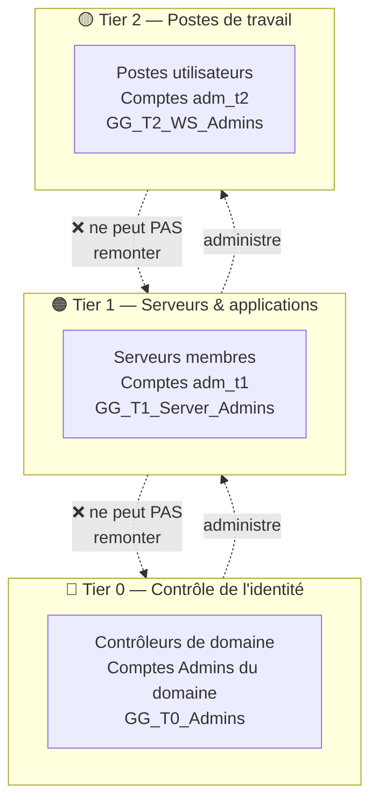
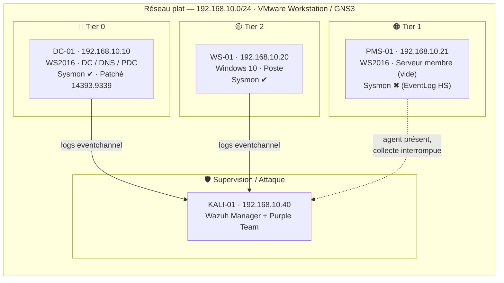
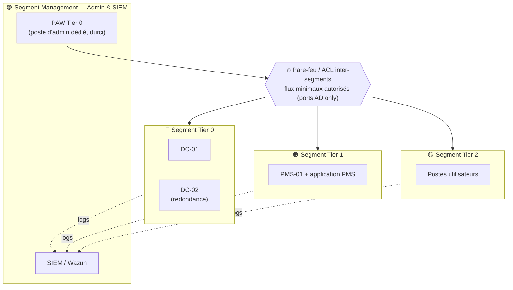

# Dossier d'architecture de sécurité — Mogador

**Projet :** Sécurisation de l'Active Directory `mogador.local` (laboratoire hôtelier fictif — PFA Purple Team)
**Objet :** Démontrer que l'architecture du système d'information est **sécurisée par conception**, présenter l'architecture réalisée, l'architecture cible de production, et justifier l'écart.
**Version :** 1.0 — 31 juillet 2026
**Classification :** Interne — PFA

---

## 1. Objet et positionnement

Ce dossier répond à l'exigence *« avoir une architecture sécurisée »*. Il établit un point essentiel :

> **Une architecture sécurisée n'est pas définie par la possession d'un équipement (pare-feu physique, FortiGate…), mais par l'application prouvée de principes de sécurité à la conception du système.**

Le projet Mogador implémente le **modèle d'accès en tiers de Microsoft** (*Enterprise Access Model / Tiered Administration*), qui est **la référence de l'industrie** pour sécuriser un annuaire Active Directory. La sécurité de l'architecture y est portée par la **structure logique** (tiers, RBAC, isolation des identifiants), le **durcissement des protocoles**, et la **surveillance en profondeur** — le tout **validé par des preuves live** (PingCastle 100→25, aucun chemin BloodHound non autorisé, 15 détections validées).

La seule couche non implémentée — la **segmentation au niveau réseau** — est **documentée en feuille de route** et justifiée par la contrainte matérielle du laboratoire (RAM/équipements). En ISO/IEC 27001, une contrainte documentée constitue une **acceptation de risque légitime**, pas un défaut.

---

## 2. Principes d'architecture sécurisée appliqués

L'architecture Mogador repose sur cinq principes reconnus. Chacun est **implémenté et prouvé** :

| Principe | Définition | Implémentation Mogador | Preuve |
|---|---|---|---|
| **Défense en profondeur** | Plusieurs couches indépendantes ; la chute d'une ne compromet pas l'ensemble | Identité (tiering) + protocoles durcis + détection SIEM | Un même PowerShell encodé détecté par **3 sources indépendantes** (Sysmon, 4688, 4104) |
| **Moindre privilège** | Chaque identité n'a que les droits strictement nécessaires | RBAC/AGDLP, `MachineAccountQuota=0`, délégations retirées, groupes privilégiés vidés | BloodHound final : aucun chemin `Hiba`/`adm_t1` → Domain Admins |
| **Cloisonnement / « Assume Breach »** | On suppose une compromission ; on limite sa propagation | Frontières Tier 0/1/2 (deny-logon, LAPS tier-isolé, comptes séparés) | Événement `4625 0xC000015B` sur tentative de connexion inter-tier |
| **Traçabilité & surveillance** | Toute action sensible est journalisée et détectable | Advanced Audit Policy + Sysmon + **SIEM Wazuh (16 règles)** | 15/16 règles validées live, latence 0,64 s, FP = 0 |
| **Sécurité par configuration** | Durcissement systématique, pas de valeur par défaut faible | SMB/LDAP signés, NTLMv2-only, LLMNR off, Spooler off, patchs à jour | PingCastle **100/100 → 25/100** |

---

## 3. Modèle de référence : administration en tiers

Le principe structurant est l'isolation des **plans de privilège** : un attaquant qui compromet un poste utilisateur (Tier 2) ne doit **jamais** pouvoir récupérer des identifiants d'administration du domaine (Tier 0).

**Règle d'or :** un identifiant d'un tier supérieur ne s'expose **jamais** sur une machine d'un tier inférieur. C'est enforced par les **GPO de refus de connexion** (`GPO_T1_Deny_T0_Logon`, `GPO_T2_Deny_T0_T1_Logon`) et l'**isolation des mots de passe** (Legacy LAPS délégué par tier).

---

## 4. Architecture réalisée (laboratoire)

### 4.1 Topologie

### 4.2 Couches de sécurité effectivement en place

| Couche | Contrôles implémentés | GPO / mécanisme |
|---|---|---|
| **Identité & tiering** | OU Tier 0/1/2, comptes d'admin séparés, RBAC/AGDLP (`GG_/DL_`) | Structure AD + groupes |
| **Frontières de tier** | Refus de connexion inter-tier (réseau/local/RDP/batch/service) | `GPO_T1_Deny_T0_Logon`, `GPO_T2_Deny_T0_T1_Logon` |
| **Secrets locaux** | Mots de passe admin local uniques & tier-isolés | `GPO_LegacyLAPS_ManagedComputers` + `DL_LAPS_T1/T2_Operators` |
| **Protocoles** | Signature SMB requise, signature LDAP requise, NTLMv2-only, LLMNR off | `GPO_SMB_Signing_Required`, `GPO_DC_LDAP_Signing_Required`, `GPO_Authentication_NTLMv2_Only`, `GPO_Disable_LLMNR` |
| **Surface d'attaque** | Spouleur d'impression désactivé (DC), SMBv1 retiré, `MachineAccountQuota=0`, délégations retirées | `GPO_DC_Disable_PrintSpooler` + durcissement AD |
| **Mots de passe** | Politique 14 car. + verrouillage ; PSO Tier 0 16 car. | Default Domain Policy + `PSO_T0_Privileged_Admins` |
| **Résilience AD** | Corbeille AD activée, OU protégées contre suppression | Configuration AD |
| **Traçabilité** | Advanced Audit Policy, PowerShell logging, Security logs 512/256 Mo | `GPO_DC_Advanced_Audit`, `GPO_Member_Advanced_Audit` |
| **Détection** | SIEM Wazuh, 16 règles AD, Sysmon (DC/WS), alerting e-mail par sévérité | Manager Kali + agents |

> **Nature des frontières :** dans le lab, les frontières de tier sont enforced au **niveau logique** (GPO, Kerberos, isolation des identifiants). Elles sont **efficaces et prouvées** (test `4625 0xC000015B`), mais **pas doublées d'une segmentation réseau** — voir §6.

---

## 5. Analyse des frontières de sécurité (couche par couche)

| Frontière | Couche logique (réalisée) | Couche réseau (cible) |
|---|---|---|
| Tier 2 → Tier 0 | ✅ Deny-logon GPO : un compte T0 ne peut ouvrir de session sur T2, et un compte T2 n'a aucun droit sur le DC | ⏳ Idéalement : VLAN séparés, le poste T2 ne peut atteindre le DC que sur les ports AD nécessaires |
| Vol d'identifiants | ✅ LAPS (mots de passe locaux uniques), NTLMv2-only, credentials tier-isolés | ⏳ PAW dédié pour l'admin T0 (jamais d'admin depuis un poste bureautique) |
| Mouvement latéral | ✅ Signature SMB, SMBv1 retiré, Spooler off, détection Sysmon/`92057` | ⏳ Filtrage inter-machines (bloquer SMB/RPC poste↔poste) |
| Exfiltration AD (DCSync/NTDS) | ✅ Détection `100033`/`100036`, Defender bloque `ntdsutil`/mimikatz | ⏳ Détection réseau (Suricata) sur segment tappable |

**Lecture :** la couche logique est **complète et prouvée**. La couche réseau viendrait la **renforcer** (défense en profondeur), sans la remplacer.

---

## 6. Architecture cible (production sécurisée)

Ce que l'on déploierait dans un environnement de production réel — présenté comme **feuille de route**, non implémenté en labo faute de matériel/RAM.

**Apports de la cible (au-delà du réalisé) :**

| Ajout | Rôle sécurité | Résiduel couvert |
|---|---|---|
| **Segmentation réseau** (VLAN/sous-réseaux + ACL/pare-feu) | Double les frontières logiques d'une frontière réseau (défense en profondeur) | `RR-06`, ISO `A.8.22` |
| **PAW** (Privileged Access Workstation) | L'admin T0 ne s'effectue que depuis un poste dédié durci, jamais bureautique | ISO `A.8.1`, `A.8.2` |
| **Bastion / jump host** | Point de passage contrôlé et journalisé pour l'admin inter-tier | ISO `A.8.3`, `A.8.15` |
| **2e contrôleur de domaine** | Redondance ; pas de point unique de défaillance | `RR-01`, ISO `A.8.14` |
| **Sauvegarde System State isolée** | Restauration AD après panne/compromission | `RR-01`, ISO `A.8.13` |
| **OS supportés** (migration WS2016/Win10) | Réception continue des correctifs de sécurité | `RR-02`, ISO `A.8.19` |
| **Windows LAPS + LDAP channel binding + réduction NTLM** | Modernisation des contrôles déjà en place | `RR-04/05/07` |

---

## 7. Analyse d'écart et justification

| Dimension | Réalisé (labo) | Cible (prod) | Écart | Décision |
|---|---|---|---|---|
| Architecture d'identité (tiering) | ✅ Complet & prouvé | ✅ Identique | Aucun | — |
| Durcissement protocoles | ✅ Complet & prouvé | ✅ Identique | Aucun | — |
| Détection / SIEM | ✅ Opérationnel | ✅ + détection réseau | Mineur | Détection réseau = option future |
| **Segmentation réseau** | ⏳ Réseau plat | ✅ VLAN + pare-feu | **Principal** | **Feuille de route — contrainte matérielle** |
| PAW / bastion | ⏳ Absent | ✅ Présent | Moyen | Feuille de route |
| Redondance DC | ⏳ DC unique | ✅ 2 DC | Moyen | Feuille de route |

**Justification de l'écart réseau (acceptation de risque documentée) :**
Le laboratoire (VMware Workstation, RAM contrainte, ~4 Go/VM) ne peut pas héberger simultanément des équipements de segmentation (pare-feu virtuel type FortiGate/pfSense) + les 4 VM sans dégrader la stabilité de l'ensemble. Ajouter cette couche **risquerait de compromettre une configuration durcie et validée** pour un gain de démonstration marginal. Conformément à la méthode ISO/IEC 27001 (traitement du risque), l'écart est **accepté et documenté** (`RR-06`, `A.8.22 partiel`) plutôt que traité par une implémentation instable. En production, cette contrainte disparaît et la segmentation est déployée selon l'architecture cible ci-dessus.

---

## 8. Correspondance ISO/IEC 27001:2022 (contrôles d'architecture)

| Contrôle | Intitulé abrégé | État Mogador |
|---|---|---|
| A.5.15 | Contrôle d'accès | ✅ Cadre Tier 0/1/2 |
| A.8.1 | Terminaux utilisateurs | ⏳ PAW en cible |
| A.8.2 | Droits d'accès privilégiés | ✅ Comptes d'admin dédiés, moindre privilège |
| A.8.3 | Restriction d'accès à l'information | ✅ Deny-logon inter-tier ; ⏳ bastion en cible |
| A.8.20 | Sécurité des réseaux | ✅ Protocoles durcis (SMB/LDAP/DNS) |
| A.8.21 | Sécurité des services réseau | ✅ Services durcis et testés |
| A.8.22 | **Séparation des réseaux** | ⚠️ **Partiel** — sous-réseau AD déclaré ; segmentation physique = feuille de route (contrainte labo) |
| A.8.14 | Redondance | ⏳ 2e DC en cible (`RR-01`) |
| A.8.15 / A.8.16 | Journalisation / Surveillance | ✅ Audit + SIEM Wazuh |

---

## 9. Argumentaire de soutenance (réponse à l'encadrant)

> *« L'architecture Mogador est sécurisée par conception : elle implémente le modèle d'administration en tiers de Microsoft — la référence de l'industrie pour Active Directory — appuyé sur le moindre privilège, le durcissement systématique des protocoles et une détection en profondeur. L'efficacité est prouvée : le score de risque est passé de 100/100 à 25/100, aucun chemin d'élévation non autorisé ne subsiste, et les attaques sont détectées en moins d'une seconde. La seule couche non implémentée — la segmentation réseau physique — est documentée en architecture cible de production ; elle n'est pas déployée en laboratoire par contrainte matérielle assumée, ce qui constitue une acceptation de risque formalisée selon la méthode ISO/IEC 27001, et non un défaut de conception. »*

**Points d'appui si le jury insiste sur le réseau :**
1. Les frontières de tier sont **déjà enforced** (preuve : `4625 0xC000015B`) — la segmentation réseau **renforcerait** la défense, elle ne comble pas une absence.
2. La contrainte matérielle est **réelle et documentée** — un choix d'ingénieur (ne pas déstabiliser une config durcie validée), pas un oubli.
3. L'architecture **cible** est entièrement spécifiée (§6) : le projet démontre la **vision** de bout en bout.

---

## 10. Références et limites

- Microsoft — *Enterprise Access Model / Active Directory administrative tier model* (modèle de référence).
- ISO/IEC 27001:2022 — Annexe A (`A.8.22`, `A.8.14`, `A.8.1–A.8.3`).
- `PROJECT_CONTEXT.md`, `README_AD_HARDENING.md`, `COMPTE_RENDU_DETECTION_PHASE_D.md`, `MATRICE_ISO27001_MOGADOR.md` — sources de vérité du projet.
- Preuves : rapports PingCastle (100→25), collecte BloodHound finale, RSOP/GPO, événements Windows, dossiers `Evidence/`.

> **Limite :** ce dossier décrit une architecture de **laboratoire PFA** alignée sur des principes de sécurité, sans revendication de certification. L'architecture cible de production nécessiterait une conception réseau détaillée (plan d'adressage, règles de pare-feu, matrice de flux) validée par une revue d'architecture dédiée.

---

*Version 1.0 — 31 juillet 2026. Document de conception — construit à partir de l'existant, sans modification de la configuration du laboratoire.*
